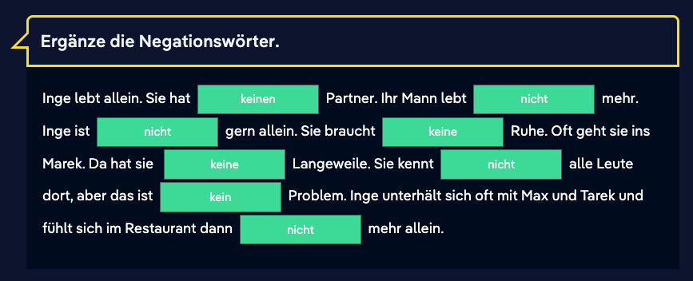
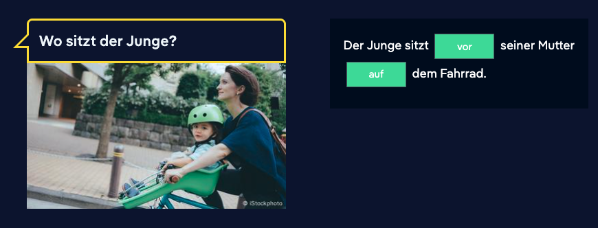
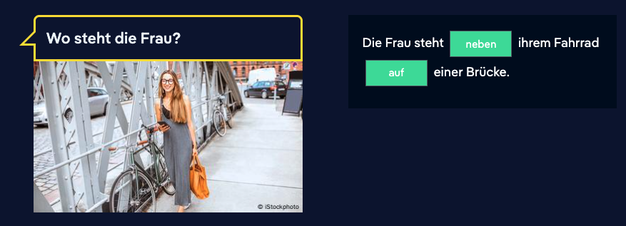
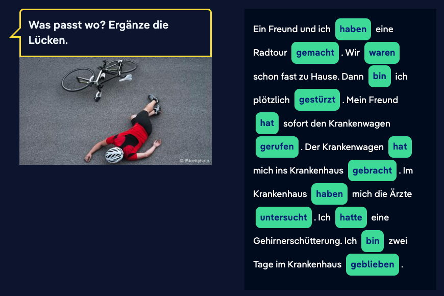

# 01 Nov

## Nicosweg A1 test

https://learngerman.dw.com/en/possessive-articles/l-44875550/e-44876907

## Possessive articles

Read the sentences and dialogue, then select the missing possessive articles in the correct order.

## Negation

Read the text about Inge and write the correct form of the missing negations “nicht“ or “kein“ in the blanks.

## Separable verbs

Listen to the questions from Nico’s audio class and put the words in the correct order to form an answer.

Was machst du im Haushalt am liebsten?
Am liebsten trockne ich das Geschirr ab.

Und was machst du nicht so gern?
Ich räume nicht gern auf.

Was machst du nach der Arbeit?
Ich kaufe im Supermarkt ein und bereite das Abendessen vor.

## Comparative and superlative

Lisa made a worksheet for her class. Look at the problems and write the missing forms in the blanks.

| **Positive (Grundform)** | **Comparative (Komparativ)** | **Superlative (Superlativ)** |
| ------------------------ | ---------------------------- | ---------------------------- |
| schön                    | **schöner**                  | am schönsten                 |
| **groß**                 | größer                       | am größten                   |
| alt                      | älter                        | **am ältesten**              |
| viel                     | **mehr**                     | am meisten                   |
| gern                     | **lieber**                   | am liebsten                  |
| gut                      | **besser**                   | **am besten**                |
| jung                     | **jünger**                   | **am jüngsten**              |

## Modal verbs

Read what Max says about working in the restaurant and select the missing modal verbs in the correct order.

## Prepositions

Look at the images and read the questions. Where are the people? Write the correct prepositions in the blanks.

- **vor** (in front of): The boy is clearly positioned in a child seat **in front of** his mother on the bike. The preposition **vor** is required to describe this location relative to his mother. (*Vor* takes the dative case here: *seiner Mutter*.)

- **zwischen** (between): This preposition is used to describe an object or person situated in the space separating two other objects or people.
- **den zwei Frauen:** The preposition *zwischen* is a two-way preposition. Because the sentence asks **Wo?** (Where?) and describes a **location** (where he is walking), it requires the **Dative** case. The Dative plural definite article is **den**.

- **neben** (next to): The woman is clearly standing beside or next to her bike. The preposition **neben** describes the location relative to the bike. *Neben* is a two-way preposition, and since this describes location (**Wo?**), it takes the **Dative** case (*ihrem Fahrrad*).
- **auf** (on/on top of): The entire scene takes place on the bridge. The preposition **auf** is used to indicate a location on a surface. *Auf* is a two-way preposition, and since this describes location (**Wo?**), it takes the **Dative** case (*einer Brücke*).

## Present perfect and past tense

Tarek is talking about his accident. Read the story and fill in the missing verbs in the present perfect or past tense.

| **Sentence Part**                   | **Word Used**           | **Base Verb**     | **Tense Structure**                                          |
| ----------------------------------- | ----------------------- | ----------------- | ------------------------------------------------------------ |
| Ein Freund und ich... Radtour       | **haben... gemacht**    | *machen*          | Perfekt (haben + Partizip II) for an action.                 |
| Wir... zu Hause.                    | **waren**               | *sein*            | Präteritum (Simple Past) of *sein* (used for general states in the past). |
| Dann ich plötzlich...               | **bin... gestürzt**     | *stürzen* (fall)  | Perfekt (sein + Partizip II) for a change of location/state. |
| Mein Freund... den Krankenwagen     | **hat... gerufen**      | *rufen* (call)    | Perfekt (haben + Partizip II) for an action.                 |
| Der Krankenwagen... ins Krankenhaus | **hat... gebracht**     | *bringen* (bring) | Perfekt (haben + Partizip II) for an action.                 |
| Im Krankenhaus... mich die Ärzte    | **haben... untersucht** | *untersuchen*     | Perfekt (haben + Partizip II) for an action.                 |
| Ich... eine Gehirnerschütterung.    | **hatte**               | *haben*           | Präteritum (Simple Past) of *haben* (used for possessions/conditions in the past). |
| Ich... zwei Tage im Krankenhaus     | **bin... geblieben**    | *bleiben* (stay)  | Perfekt (sein + Partizip II) for a state of staying.         |

A1 result with the help of AI:

