# 10 Nov

## Deutsch für fortgeschrittene Anfänger 2.1 (A2) part 6 - Eine witzige Familie - Grammatik

Files:

-  [3_Eine_witzige_Familie_Grammatik.pdf](files/3_Eine_witzige_Familie_Grammatik.pdf)  
- [27117__Transcript.pdf](files/27117__Transcript.pdf) 
- [Grammatikglossar_A2_-_En.pdf](files/Grammatikglossar_A2_-_En.pdf) 


**Satze:**

- Er trägt seine Lieblingsmütze.
  He is wearing his favorite cap.

- Er ist immer noch sehr nett
  He is still very nice

- Patrick trägt eine Schwimmbrille.
  Patrick is wearing swimming goggles.

- Katrins Großvater **lebt noch**, aber ihre Oma ist **tot**.
  Katrin's grandfather is **still alive,** but her grandmother is **dead**.

   


**Vokabeln:**

- ungefähr = about


### Possessiva

du -> dein / deine

meinen/deinen Freund

deine Freundin

deien Freunde

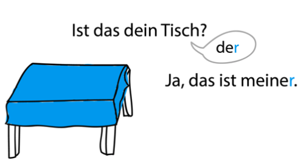

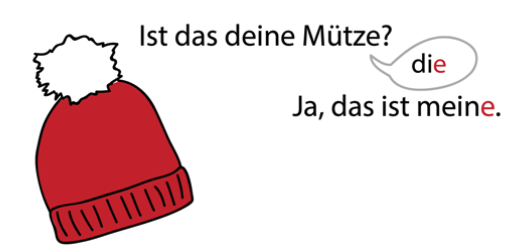

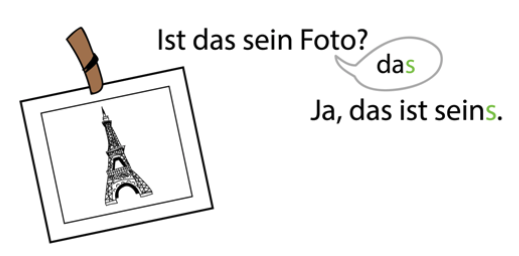

### 

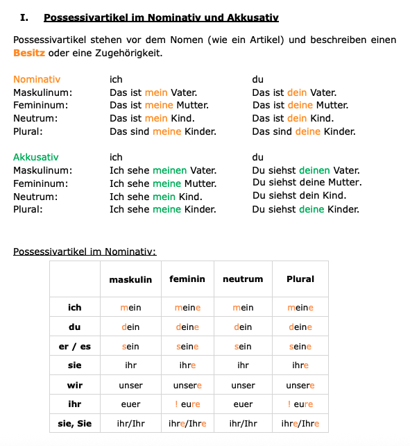

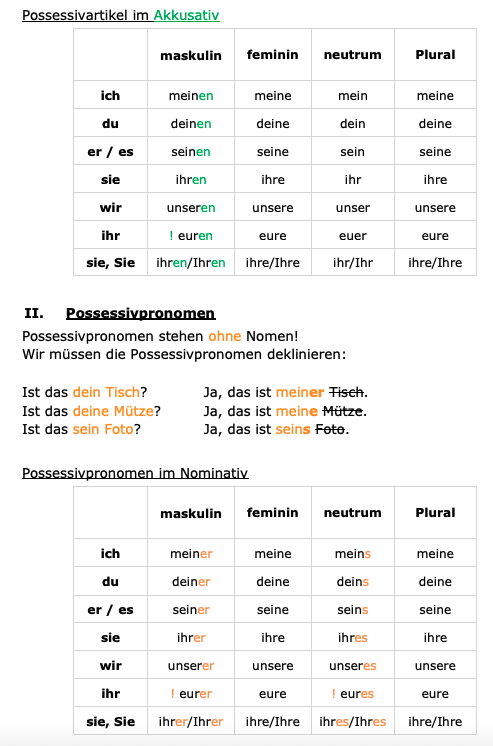

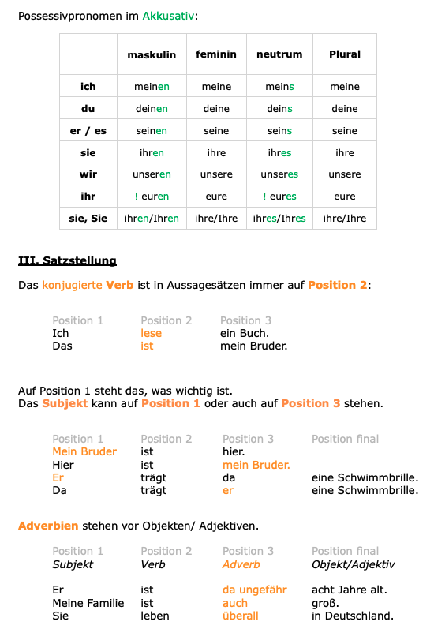


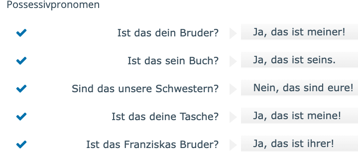

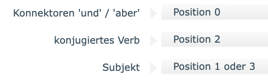

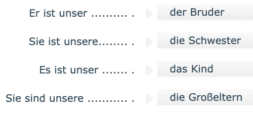


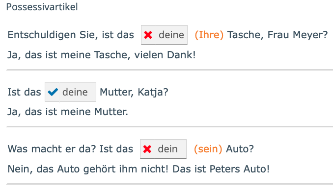

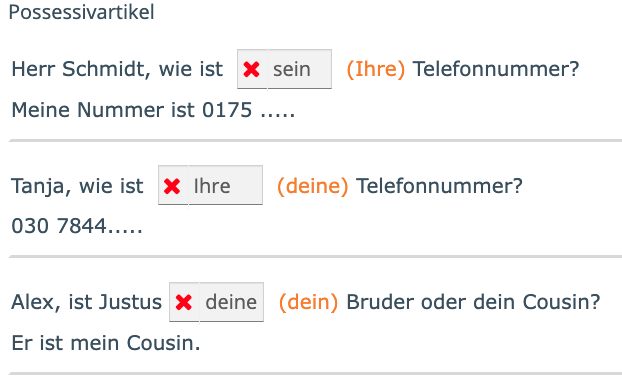

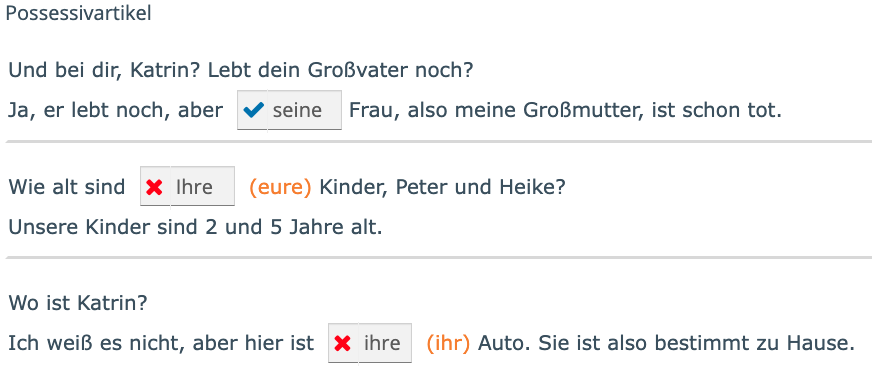

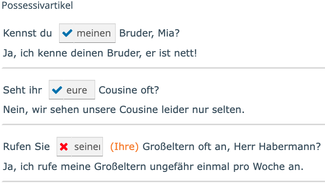


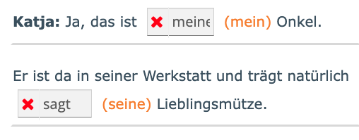

# 09 Nov

## Deutsch für fortgeschrittene Anfänger 2.1 (A2) part 5 - Eine witzige Familie

**Sätze:**

- Ja, das stimmt = Yes, that's true
- Sie ist sogar schon Mutter = She is even a mother already
- Er (**ist verheiratet**) und hat zwei Kinder = He (**is married**) and has two children.
- **Wieso** kommst du nicht auch mit? = **Why** don't you come along too?
- Die **Mütze** habe ich als Kind immer im Winter getragen = I always wore this **hat** in winter when I was a child.
- Auf dem Foto ist meine Schwester noch ein Baby = In the photo my sister is still a baby.
- Leider hat sie keine Großeltern mehr = Unfortunately, she no longer has any grandparents

**Vokabeln:**

- witzig oder lustig = funny
- hübsch oder schön = pretty
- freundlich oder nett = friendly
- Lieblingsmütze = favourite hat
- wahr / 
- schlect / gut = bad / good
- dünn / dick = thin / thick
- hell / duknel = bright / dark
- traurig / lustig = sad / funny
- sauer / süß = sour / sweet
- dreckig = dirty
- Mütze = hat
- ausüben = exercise
- ehefrau = wife
- Sie lacht = she laughs
- Sie badet = she is bathing
- erwachsen = adult
- Urgroßmutter und Urgroßvater = Great Grandmother and Great Grandfather

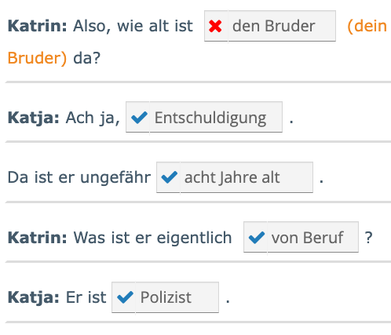


# 08 Nov

## Deutsch für fortgeschrittene Anfänger 2.1 (A2) part 4 - Auf dem Markt - Grammatik

**Vokabeln:**

- Ich nehme = I take
- Ich brauche = I need

Singular vs Plural

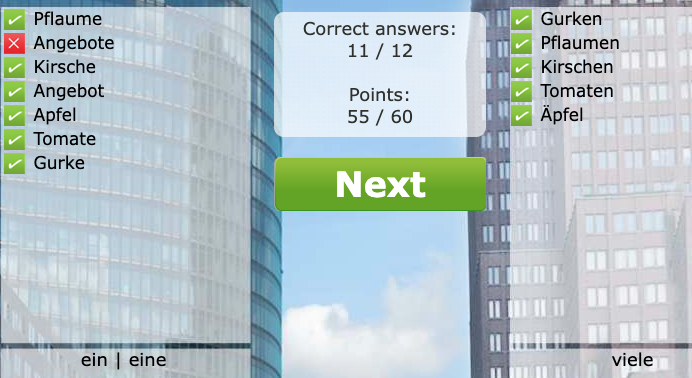

Artikel

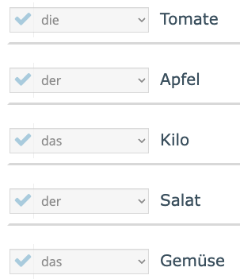

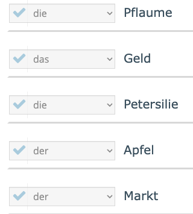


Plural: +e

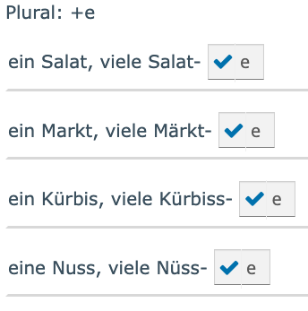


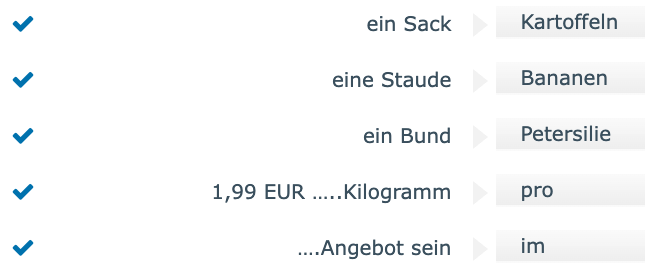

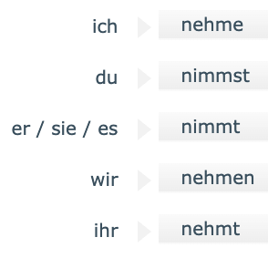


Artikel ein - einen - eine

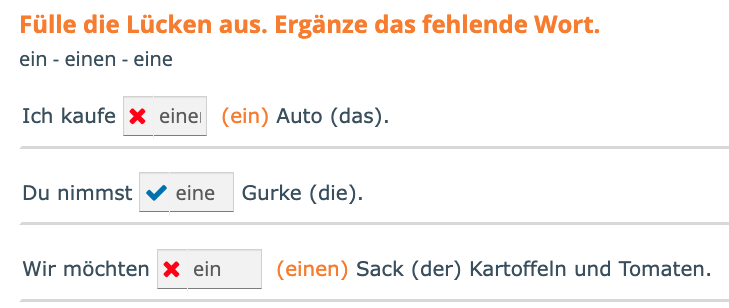

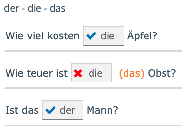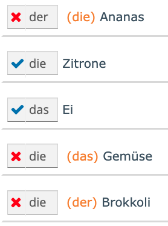

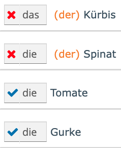

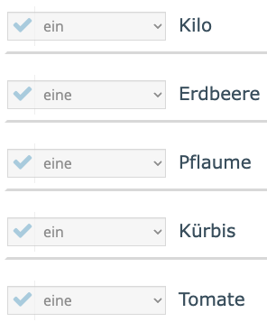

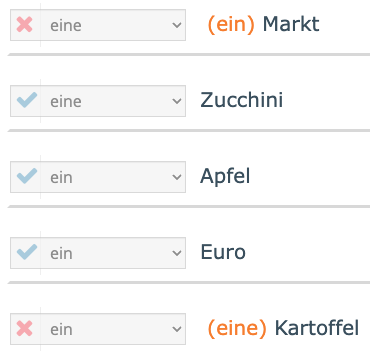

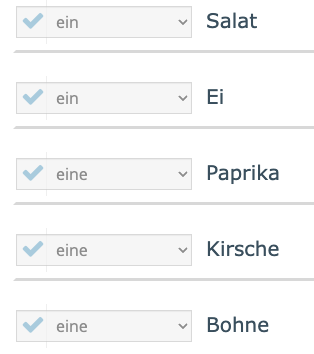

**Negation**

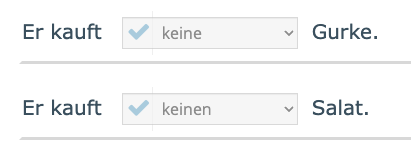

**unbestimmter Artikel**

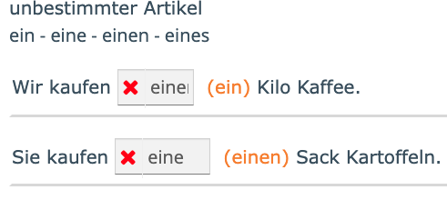

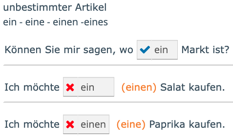


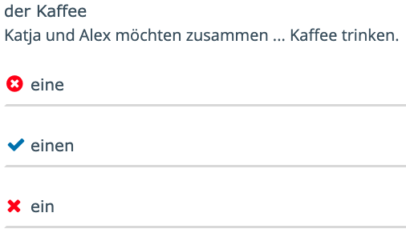

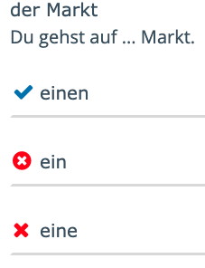

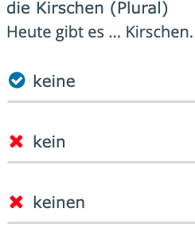


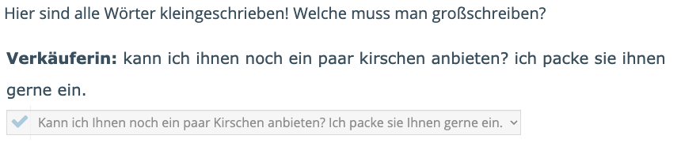

- Kann - Kirschen - Ihnen

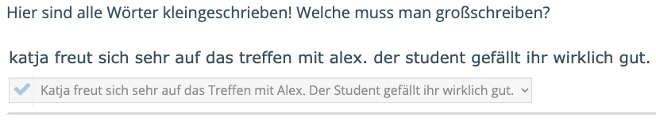

- Katja - Treffen - Alex - Student


nicht vs kein

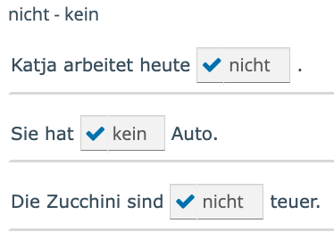

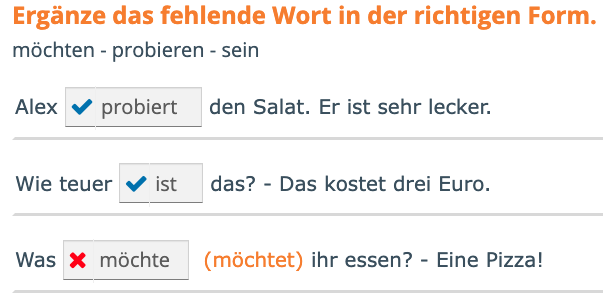

# 07 Nov

## AStA A2 German course homework #2

From Arne

```
Nehmt das als Orientierung für die Hausaufgabe und schreibt 5 Sätze auf ( mit dem Partizip 2). Gerne auch was euch persönlich passiert ist, z.B. Am Wochenende habe ich( …).. Fände super wenn möglichst viele die Aufgabe machen, sodass wir diese Anfang nächster Stunde besprechen können. Die Aufgaben sind aber natürlich nicht verpflichtend/ ein Muss.
```

```
Use this as a guide for your homework and write 5 sentences (using the past participle). Feel free to also include something that happened to you personally, e.g., "Over the weekend I (...)." It would be great if as many of you as possible could do the assignment so we can discuss it at the beginning of next lesson. Of course, completing the assignment is not mandatory.
```

 [Partizip_II_Handout_A2_Klar.pdf](files/Partizip_II_Handout_A2_Klar.pdf) 

- Am Wochenende **bin** ich nach Hamburg **gegangen**.
  (went / gone) (gehen -> gegangen)
- Ich habe gestern abend in der Bremer Stadtbibliothek ein PS5-Spiel **ausgeliehen**.
  (borrowed) (ausleihen -> ausgeliehen)
- Vor einem Jahr bin ich nach Deutschland **gezogen**.
  (ziehen = pull/drag)
- Ich habe alles in Indonesien **aufgegeben** und hier in Deutschland neu **angefangen**
- In Australien habe ich im Restaurant **gearbeitet**.


Irregular verbs (unregelmäßige Verben)

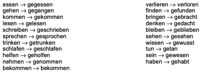


# 06 Nov

## Deutsch für fortgeschrittene Anfänger 2.1 (A2) - part 3 - Auf dem Markt

**Satzen:**

- Wie viele kosten die Äpfel? / Wie teuer sind die Äpfel?
- Wie teuer ist das denn?
  How expensive is that?
- Nein, die haben wir leider heute nicht
  (No, unfortunately we don't have that today).
- Tomaten auf den Augen haben
  to have tomate on their eyes
- etwas nicht sehen, das ganz klar oder nah ist
  Not seeing something that is very clear or close
- Möchten Sie noch etwas?
  Would you like anything else?

**Vokabeln:**

- Weintrauben = grapes
- pflaume = plum
- petersilie = parsley
- wahr = true
- falsch = false
- eigentlich = actually


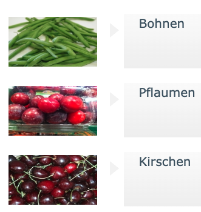


Ordering sentence:

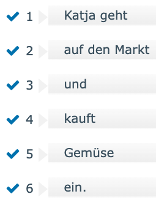

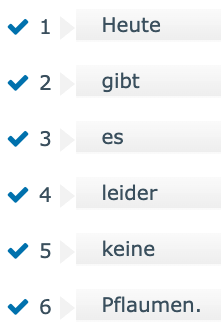

Correct form:

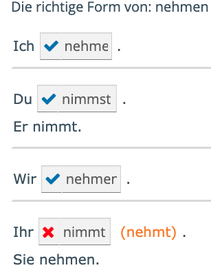

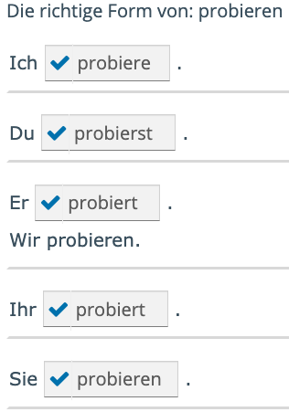

# 05 Nov

## Deutsch für fortgeschrittene Anfänger 2.1 (A2) part 2 - Grammatik

Sätze:

- Seid **ihr** beide 25 Jahre alt?
- Habt **ihr** morgen Zeit?
- Ich gehe jetzt **einkaufen**
- Was bist du **von** Beruf?
- Katja **möchte** mal Künstlerin werden.
- Hast du einen Tipp für eine Wochensuche?
- Wie **heißt** ihr?
- **Sprichst** du Deutsch?
- Wie heißt er?
- **Spricht** er Deutsch?
- **Gehst** du jetzt einkaufen?
- **Habt** ihr morgen Zeit?
- Du **arbeitest**
- Du **badest** (taking shower)
- Sie **fährt** nach Hause (She drives to home)

# 04 Nov

## Deutsch für fortgeschrittene Anfänger 2.1 (A2) - part 1 - Die erste Begegnung

https://onleihe.linguatv.com/#openWindow_rbmWindow_cs1602218455

**Sätzen:**

- Alex und Katja gehen morgen Kaffee trinken
- Was suchst du?
  What are you looking for?

**Vokabeln:**

- Verabreddung = appointment
- einkaufen gehen = go for shopping
- Die erste Begegnung = the first encounter
- Begrüßung = greeting
- Abschied = farewell
- Künstlerin = artist
- spät = late
- Verzeihun = forgiveness


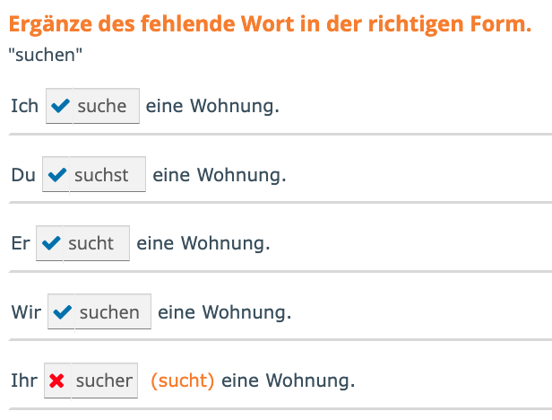

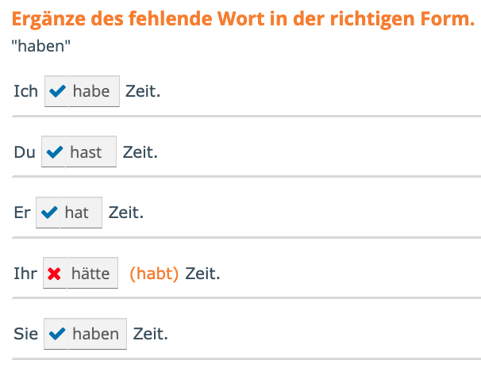

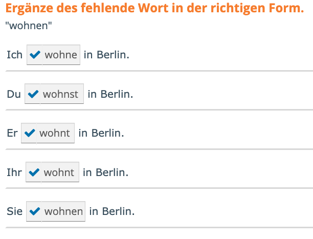

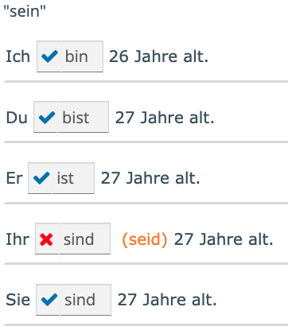


## Grammatik

https://onleihe.linguatv.com/#toLevel_object_29282

Wie spät ist es?
Es ist 12 Uhr

Files:

- [1_Die_erste_Begegnung_Grammatik2.pdf](files/1_Die_erste_Begegnung_Grammatik2.pdf) 
- [27126__Transcript.pdf](files/27126__Transcript.pdf)  
- [Grammatikglossar_A2_-_En.pdf](files/Grammatikglossar_A2_-_En.pdf) 

# 03 Nov

## Homework from German A2 course Week 1 - part 2

## Berlin – eine Stadt mit richtig viel Wasser

Autorin: **IP** (Stadtgrenze, Spree und Havel (zwei Flüsse), Amsterdam, Stockholm, Trinkwasserreserven, Venedig)

https://www.deutsch-to-go.de/berlin-eine-stadt-mit-richtig-viel-wasser/

```
Berlin gilt nicht gerade als Wasserstadt – schließlich liegt die Hauptstadt Deutschlands nicht am Meer. Berlin hat aber mehr Wasser zu bieten, als man auf den ersten Blick meint. Denn es gibt innerhalb der Stadtgrenze nicht nur Flüsse wie die Spree und die Havel, sondern auch zahlreiche Bäche und Kanäle. Und sogar 80 Seen! Berlin hat mit rund 59 Quadratkilometern Wasserfläche mehr Wasser innerhalb der Stadtgrenze als die meisten anderen europäischen Hauptstädte. Überraschenderweise sogar mehr als Amsterdam oder Stockholm. Außerdem stehen rund 25 Prozent des Berliner Stadtgebiets unter Wasserschutz. In diesen Gebieten findet man Trinkwasserreserven tief unter der Erde, die besonders
geschützt werden.

Eine weitere interessante Info: Berlin hat mehr Brücken als Venedig. Sogar mehr als doppelt so viele. Aber kein Vergleich mit Hamburg – diese Stadt allein hat über 2.500 Brücken, mehr als jede andere Metropole in Europa!

(137 Wörter)

```

Translation:
```
Berlin isn't exactly known as a water city – after all, Germany's capital isn't on the coast. But Berlin has more water to offer than you might think at first glance. Within its city limits, there are not only rivers like the Spree and the Havel, but also numerous streams and canals. And even 80 lakes! With approximately 59 square kilometers of water surface, Berlin has more water within its city limits than most other European capitals. Surprisingly, even more than Amsterdam or Stockholm. Furthermore, around 25 percent of Berlin's urban area is under water protection. In these areas, you'll find drinking water reserves deep underground, which are given special protection.

Another interesting fact: Berlin has more bridges than Venice. In fact, more than twice as many. But that's nothing compared to Hamburg – that city alone has over 2,500 bridges, more than any other metropolis in Europe!

(137 words)
```


### Q&A

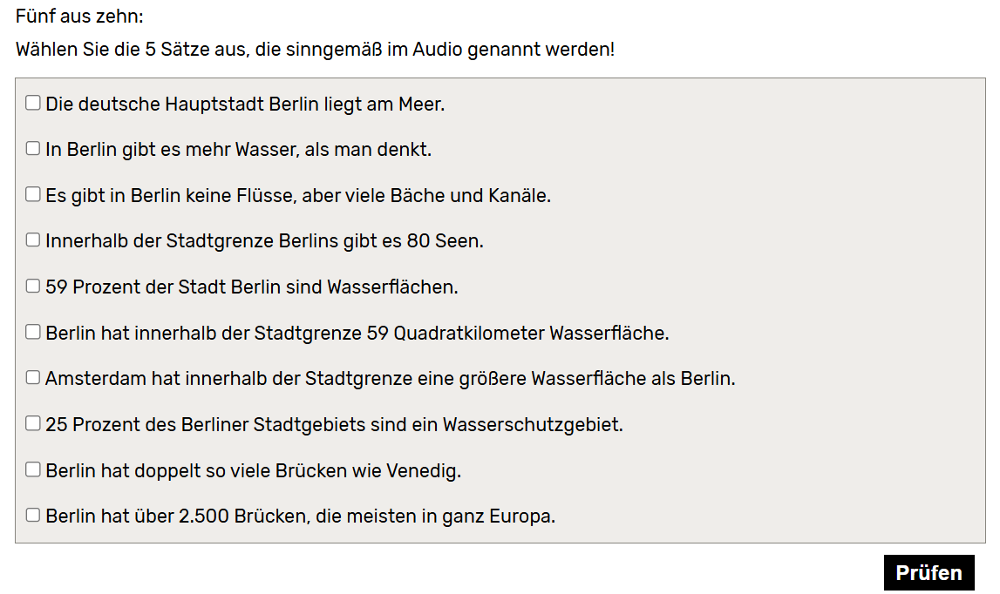

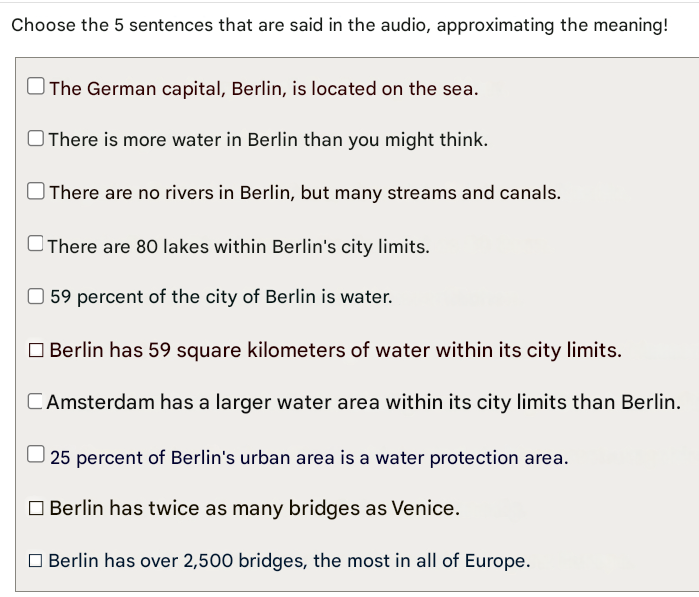


#### Welche Präposition passt?

**Berlin liegt nicht _____ Meer.**
am

**Berlin hat aber mehr Wasser, als man _____ den ersten Blick meint.**
auf

**_____ der Stadtgrenze Berlins gibt es 80 Seen.**
Innerhalb

**Wichtige Trinkwasservorkommen liegen tief _____ der Erde.**
unter

**Hamburg hat _____ 2.500 Brücken.**
über


### Summary

Berlin liegt zwar nicht an der Küste, hat aber mehr Wasser, als man denkt. Innerhalb der Stadtgrenze Berlins gibt es 80 Seen. Berlin hat doppelt so viele Brücken wie Venedig.

# 02 Nov

## Homework from German A2 course Week 1 - part 1

Hi, thanks to everyone who came! Regarding the homework: Choose two topics/audio examples from the website. Answer the corresponding questions. Write a summary in 3-5 sentences. What was it about and what happened? See you next week!

Link:
https://www.deutsch-to-go.de/lernen/hoertexte-einfach/hoertexte-einfach-a2/ 

Slide:
https://1drv.ms/p/c/94779ab562335853/EaICp5i9fcNGvL-D71zyVAQBzlj0j5Pr_70MEwi-66mBmA?e=ZfLVar


## Mensch und Maschine 

Autorin: **IP** (Geräte, streiken, Umfrage, anbrüllen, wütend, handgreiflich werden)

https://www.deutsch-to-go.de/mensch-und-maschine/

```
Haben Sie Ihrem Auto, Staubsauger oder Computer schon mal einen Namen gegeben? 

Viele machen das. Für sie sind bestimmte Geräte wie Familienmitglieder. Besonders moderne Maschinen mit künstlicher Intelligenz wirken manchmal schon sehr selbstständig: Sie verstehen die menschliche Sprache, interpretieren sie und antworten. 

Manche Menschen glauben sogar, dass ihre Geräte menschliche Stimmungen zeigen, also auch mal müde oder beleidigt sind. 

Und wie reagieren Menschen, wenn ihre Haushaltsgeräte oder Computer streiken, also plötzlich nicht mehr richtig funktionieren? 

Eine Umfrage in Deutschland unter 1.000 Personen hat gezeigt: 70 Prozent von ihnen haben ihre technischen Geräte dann schon einmal angebrüllt, weil sie wütend waren. Männer mit 75 Prozent etwas häufiger als Frauen mit 65 Prozent. Drei Prozent aller Befragten wurden sogar schon handgreiflich. Das heißt, sie haben ihre Maschine nicht mit Worten attackiert, sondern mit Händen oder auch mit Füßen.
```

Translation:

```
Have you ever given your car, vacuum cleaner, or computer a name?

Many people do. For them, certain devices are like family members. Especially modern machines with artificial intelligence sometimes seem very independent: They understand human language, interpret it, and respond.

Some people even believe that their devices show human moods, that they can get tired or offended.

And how do people react when their household appliances or computers break down, that is, suddenly stop working properly?

A survey in Germany of 1,000 people showed that 70 percent of them have yelled at their technical devices because they were angry. Men did so slightly more often (75 percent) than women (65 percent). Three percent of all respondents even resorted to physical violence. That is, they didn't attack their machine with words, but with their hands or even feet.
```


### Q&A

#### part 1


Translation:


Answer:


#### part 2

**Haben Sie Ihrem Staubsauger einen Namen _____?**
gegeben (give)

**Moderne Maschinen mit künstlicher Intelligenz _____ sehr selbstständig.**
wirken (act / work)

**Manchmal _____ technische Geräte, das heißt sie funktionieren plötzlich nicht mehr.**
streiken (strike)

**Wie _____ Menschen, wenn ihre technischen Geräte nicht mehr funktionieren?**
reagieren (react / respond)

**Viele Menschen _____ ihre technischen Geräte _____, wenn sie nicht funktionieren.**
brüllen .... an (yelled)


### Summary

Für viele Menschen sind bestimmte Geräte wie Familienmitglieder. Mit der Entwicklung von KI wurden einige Geräte personalisiert und scheinen Emotionen zu haben. Menschen können ihre Geräte anbrüllen, weil sie wütend sind.

For many people, certain devices are like family members. With the development of AI, some devices have become personalized and seem to possess emotions. People might yell at their devices because they are angry.

# 01 Nov

## Nicosweg A1 test

https://learngerman.dw.com/en/possessive-articles/l-44875550/e-44876907


## Possessive articles

Read the sentences and dialogue, then select the missing possessive articles in the correct order.


## Negation

Read the text about Inge and write the correct form of the missing negations “nicht“ or “kein“ in the blanks.


## Separable verbs

Listen to the questions from Nico’s audio class and put the words in the correct order to form an answer.

Was machst du im Haushalt am liebsten?
Am liebsten trockne ich das Geschirr ab.

Und was machst du nicht so gern?
Ich räume nicht gern auf.

Was machst du nach der Arbeit?
Ich kaufe im Supermarkt ein und bereite das Abendessen vor.


## Comparative and superlative

Lisa made a worksheet for her class. Look at the problems and write the missing forms in the blanks.

| **Positive (Grundform)** | **Comparative (Komparativ)** | **Superlative (Superlativ)** |
| ------------------------ | ---------------------------- | ---------------------------- |
| schön                    | **schöner**                  | am schönsten                 |
| **groß**                 | größer                       | am größten                   |
| alt                      | älter                        | **am ältesten**              |
| viel                     | **mehr**                     | am meisten                   |
| gern                     | **lieber**                   | am liebsten                  |
| gut                      | **besser**                   | **am besten**                |
| jung                     | **jünger**                   | **am jüngsten**              |


## Modal verbs

Read what Max says about working in the restaurant and select the missing modal verbs in the correct order.


## Prepositions

Look at the images and read the questions. Where are the people? Write the correct prepositions in the blanks.


- **vor** (in front of): The boy is clearly positioned in a child seat **in front of** his mother on the bike. The preposition **vor** is required to describe this location relative to his mother. (*Vor* takes the dative case here: *seiner Mutter*.)


- **zwischen** (between): This preposition is used to describe an object or person situated in the space separating two other objects or people.
- **den zwei Frauen:** The preposition *zwischen* is a two-way preposition. Because the sentence asks **Wo?** (Where?) and describes a **location** (where he is walking), it requires the **Dative** case. The Dative plural definite article is **den**.


- **neben** (next to): The woman is clearly standing beside or next to her bike. The preposition **neben** describes the location relative to the bike. *Neben* is a two-way preposition, and since this describes location (**Wo?**), it takes the **Dative** case (*ihrem Fahrrad*).
- **auf** (on/on top of): The entire scene takes place on the bridge. The preposition **auf** is used to indicate a location on a surface. *Auf* is a two-way preposition, and since this describes location (**Wo?**), it takes the **Dative** case (*einer Brücke*).


## Present perfect and past tense

Tarek is talking about his accident. Read the story and fill in the missing verbs in the present perfect or past tense.

| **Sentence Part**                   | **Word Used**           | **Base Verb**     | **Tense Structure**                                          |
| ----------------------------------- | ----------------------- | ----------------- | ------------------------------------------------------------ |
| Ein Freund und ich... Radtour       | **haben... gemacht**    | *machen*          | Perfekt (haben + Partizip II) for an action.                 |
| Wir... zu Hause.                    | **waren**               | *sein*            | Präteritum (Simple Past) of *sein* (used for general states in the past). |
| Dann ich plötzlich...               | **bin... gestürzt**     | *stürzen* (fall)  | Perfekt (sein + Partizip II) for a change of location/state. |
| Mein Freund... den Krankenwagen     | **hat... gerufen**      | *rufen* (call)    | Perfekt (haben + Partizip II) for an action.                 |
| Der Krankenwagen... ins Krankenhaus | **hat... gebracht**     | *bringen* (bring) | Perfekt (haben + Partizip II) for an action.                 |
| Im Krankenhaus... mich die Ärzte    | **haben... untersucht** | *untersuchen*     | Perfekt (haben + Partizip II) for an action.                 |
| Ich... eine Gehirnerschütterung.    | **hatte**               | *haben*           | Präteritum (Simple Past) of *haben* (used for possessions/conditions in the past). |
| Ich... zwei Tage im Krankenhaus     | **bin... geblieben**    | *bleiben* (stay)  | Perfekt (sein + Partizip II) for a state of staying.         |


A1 result with the help of AI:


