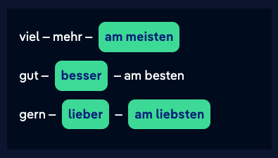
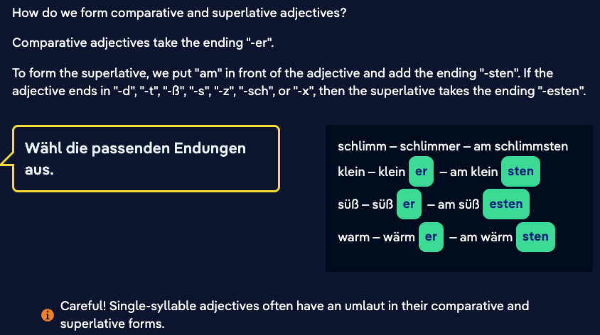
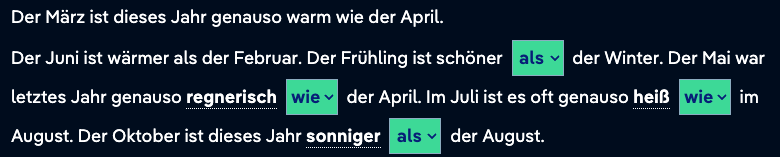
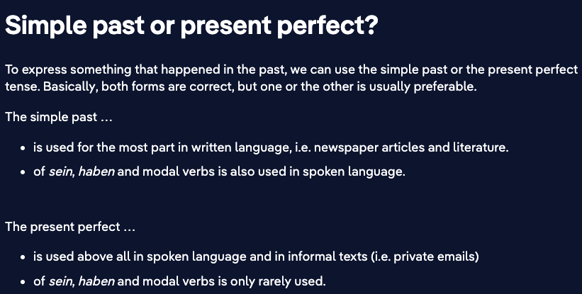
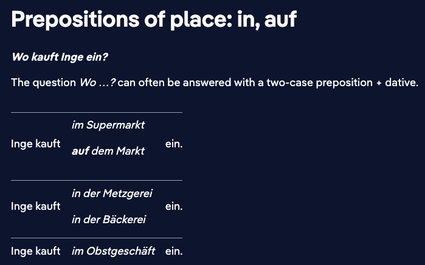

# Week 1

## 03 Oct

### Nicosweg A1 - Chapter 13 Weather and Holiday - part 2

**Sentences:**

- Die Männer haben Nicos Tasche genommen.
  The men took Nico's bag.
- Frühling ist es wärmer [als](https://learngerman.dw.com/en/when-is-it-warmer-when-is-it-colder/l-37651758/e-37654612#) im Winter.
- Im Herbst ist es nicht so kalt wie im Winter
- Im Winter ist es kälter als im Herbst.

**Vocab:**

- Frühling = Spring
- Sommer = Summer
- Herbst = Autumn
- Winter = Winter

#### Irregular comparative and superlative

#### Regular comparative and superlative

#### Making comparisons

When we are referring to equal attributes (e.g., the same size as, as good as), we use the standard form of the adjective. The adjective is then preceded by "[genauso](https://learngerman.dw.com/en/making-comparisons/l-37651758/e-39035319#)" and followed by "[wie](https://learngerman.dw.com/en/making-comparisons/l-37651758/e-39035319#)". In the case of a direct comparison, we use "[als](https://learngerman.dw.com/en/making-comparisons/l-37651758/e-39035319#)" after the comparative adjective.

#### Comparative

Diesen Winter ist es sehr kalt. Aber im letzten Winter war es ***als*** diesen Winter. Im Jahr 2009 war es am kältesten.

#### Superlative

Morgen wird es warm. Übermorgen wird es wärmer als morgen. Aber am Wochenende wird es ***am wärmsten***.

## 02 Oct

### Nicosweg A1 - Chapter 13 Weather and Holiday - part 1

https://learngerman.dw.com/en/how-was-your-vacation/l-37648534/e-37649202

**Sentences:**

- Was sagt der Mann am Telefon?
  What does the man on the phone say?
- Wo war er im Urlaub?
  Where was he on vacation?
- Im Urlaub kann man Sehenswürdigkeiten besichtigen.
  On holiday you can visit sights.
- Im Urlaub kann man am Strand faulenzen.
  On holiday you can laze on the beach.
- Ja, natürlich habe ich auch Fotos vom Hotel gemacht.
  Yes, of course I also took photos of the hotel.
- Karls Mutter faulenzt gerade.
  Karl's mother is lazing around.
- Gestern habe ich auch eine Wanderung gemacht. Das war anstrengend, aber schön!
  Yesterday I also went on a hike. That was exhausting, but nice!
- Ich mache gar nichts
  I don't do anything.

**Vocab:**

- der Strand = the beach
- die Berge = the mountain
- die Insel = the island
- Meer = more
- die Wanderung, die Wanderungen = hike; trek
- faulenze = lazing around

**Past participle:**
A regular past participle begins with "ge-", followed by the verb root and ending in "-t". 

- machen: ge-mach-t
  kochen: ge-koch-t
  faulenzen: ge-faulenz-t 

### Present perfect with "haben"

*Gestern **haben** wir eine Wanderung **gemacht**.*

This sentence is in the present perfect tense. In spoken German, this tense is generally used to express something that took place in the past.

The present perfect consists of two parts:

- In second position in the sentence there is an auxiliary verb, usually the verb *haben.* It is conjugated as in the present tense.
- The action that is being described in the sentence is expressed with the second verb, which comes at the end of the sentence. This verb takes a special form known as the past participle. Most past participles begins with the prefix *ge-**.* In present perfect sentences, the past participle is an infinitive verb form, meaning it is not conjugated.

**Present perfect:** ***haben\*** (conjugated) **+ \*past participle:\***

*Was **habt** ihr gestern **gemacht**?
Wir **haben** eine Wanderung **gemacht**.*

Grammatical terms in German:
das **Perfekt**: The present perfect is a tense used to describe the past. It comprises a conjugated auxiliary verb (*haben* or *sein*) and the past participle.

## 01 Oct

### Nicosweg A1 - Chapter 12 Food

https://learngerman.dw.com/en/mengen-und-preise/l-37628421

**Sentences:**

- Inge bekommt 1,40 Euro zurück = Inge gets 1.40 Euros back
- Was darf es sein? = What would you like?
  - Ich hätte gern 350 g Salami
- Darf es sonst noch etwas sein? = Would you like something else?
  - Ich nehme bitte noch 200 g Schinken = I'll take another 200 g of ham, please.
- Sonst noch etwas? = Anything else?
- In Deutschland gibt es mehr als 300 Brotrezepte. = There are more than 300 bread recipes in Germany.
- Wie viel kosten .. ?
- Wie teuer ist ... ?
- Was brät man nicht? = What do you not fry?
- Was backt man nicht? = What do you not bake?
- Was kochst am liebsten = 

**Vocab**:

- Pfund = ~500 grams / pound
- Metzgerei = Butcher's shop
- noch = more
- Kunde / Kundin = Customer
- Verkäufer / Verkäuferin = Salesperson
- die Zwiebel = Onion
- das Mehl = Flour
- schneiden = cut
- braten = fry
- kochen = cook
- backen = bake
- Streifen = strip, band
- am liebsten = prefer
- Tafel Schokolade = bar of Chocolate
- Dose Mais = can of corn

