# Week 1

## 07 Oct

### Nicosweg A1 - Chapter 14 Clothing - part 1

**Vocabs:**

- der Pullover = sweater
- Hose = pants
- die Turnschuhe = sneakers
- Farbe = color

#### "ein", "eine" or "einen"?

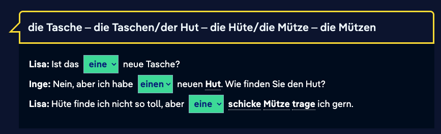

#### Declension of adjectives

After an indefinite article, adjectives in the nominative and accusative cases take the same ending as the definite article.

After an indefinite masculine article, the nominative adjectival ending is "-er", like "der", and the accusative ending is "-en", like "den".

After an indefinite feminine article, the adjectival ending in the nominative and accusative is "-e", like "die".

After an indefinite neuter article, the adjectival ending in the nominative and accusative is "-s", like "das".

Before plural nouns, the adjectival ending is always "-e", like "die".

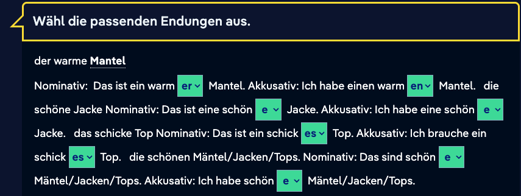

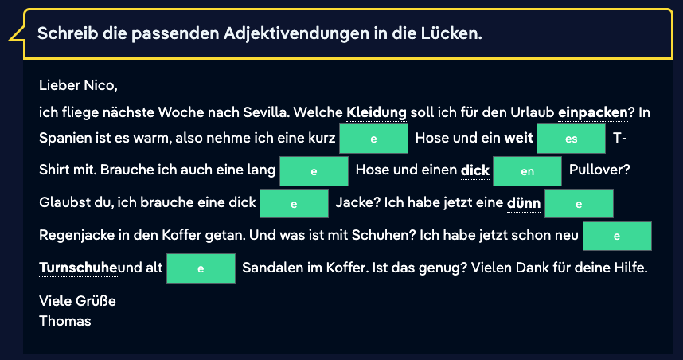

## 05 + 06 Oct

### Practice Nominative / Akkusativ / Dativ via ChatGPT and Google Gemini

| Infinitiv | Perfekt                        | Meaning             |
| --------- | ------------------------------ | ------------------- |
| lernen    | Ich habe Deutsch gelernt.      | I learned German.   |
| essen     | Er hat Pizza gegessen.         | He ate pizza.       |
| fahren    | Wir sind nach Berlin gefahren. | We drove to Berlin. |
| schlafen  | Du hast lange geschlafen.      | You slept long.     |

#### Short overview

| **Case**      | **Used for**                          | **Question word** | **Example**                     |
| ------------- | ------------------------------------- | ----------------- | ------------------------------- |
| **Nominativ** | Subject (who/what does the action?)   | **Wer? / Was?**   | **Der Mann** isst.              |
| **Akkusativ** | Direct object (who/what is affected?) | **Wen? / Was?**   | Ich sehe **den Mann**.          |
| **Dativ**     | Indirect object (to/for whom?)        | **Wem?**          | Ich gebe **dem Mann** ein Buch. |

## 

#### Definite articles (der/die/das → changes)

| Case          | Masculine | Feminine | Neuter | Plural             |
| ------------- | --------- | -------- | ------ | ------------------ |
| **Nominativ** | der       | die      | das    | die                |
| **Akkusativ** | den       | die      | das    | die                |
| **Dativ**     | dem       | der      | dem    | den (+ -n on noun) |

#### Pronoun Case Practice

| **Pronoun Choice**       | **Nominative** | **Accusative** | **Dative** |
| ------------------------ | -------------- | -------------- | ---------- |
| I / me                   | **ich**        | **mich**       | **mir**    |
| you (singular, informal) | **du**         | **dich**       | **dir**    |
| he / him                 | **er**         | **ihn**        | **ihm**    |
| she / her                | **sie**        | **sie**        | **ihr**    |
| we / us                  | **wir**        | **uns**        | **uns**    |
| they / them              | **sie**        | **sie**        | **ihnen**  |

## 04 Oct

### Nicosweg A1 - Chapter 13 Weather and Holiday - part 3 and 4

**Sentences:**

- Wir haben die Hochzeit von meinem Onkel gefeiert.
  We celebrated my uncle's wedding.

- Wir sind geschwommen und wir haben gegrillt.

  We swam and we barbecued or grilled.

- Wir haben bei meiner Cousine übernachtet.
  We spent the night at my cousin's.

- Wir haben drei Jahreszeiten: eine heiße Jahreszeit, die Regenzeit und eine [kühle](https://learngerman.dw.com/en/weather-and-climate/l-37653197/e-37654435#) Jahreszeit.
  We have three seasons: a hot season, the rainy season and a cool season.

- Vorgestern war es kalt und regnerisch. Der Himmel war grau.
  The day before yesterday it was cold and rainy. The sky was gray.

- An einem Morgen im Urlaub war es sehr neblig.
  One morning on vacation it was very foggy.

- Wir sind im Urlaub spät aufgewacht.
  We woke up late on vacation.

- Wir sind im Urlaub spät eingeschlafen.
  We fell asleep late on vacation.

- Im Urlaub sind wir selten im Hotel geblieben.
  On holiday, we rarely stayed in the hotel.

- Im Nebel ist ein Unfall passiert.
  In the Fog accident happened.

**Vocab:**

- Der Ausflug = the excursion
- regnerisch = rainy
- bewölkt = cloudy
- neblig = foggy
- schneit / Schnee = snow

#### Article

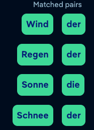

#### Talking about the weather

When talking about the weather, the subject is neuter because it is impossible to say "who" or "what" is raining. In German, the word "es" is used to refer to the weather. There are two ways to say this:

1. Es ist + adjective
   Es ist sonnig.

2. Es + verb
   Es regnet.

**Grammar**

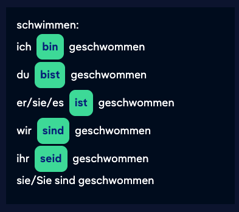

#### **Partizipien II (past form)**

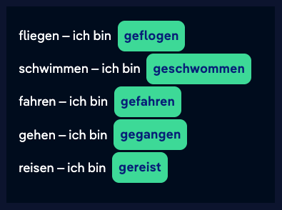

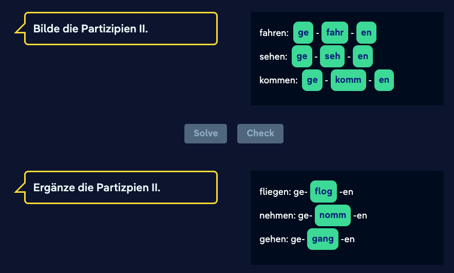

- lachen - gelacht

##### Past participle: Verbs with prefixes (1)

- Verbs with inseparable prefixes like "be-", "zer-", "er-", "ent-", "ver-", etc. form the past participle without "ge-" at the beginning.
  - beginnen → (hat) begonnen
  - verrühren → (hat) verrührt
- By the way: Verbs with the ending "-ieren" also form the past participle without "ge-" and always end in "-t".
  - studieren → (hat) studiert

##### Past participle: Verbs with prefixes (2)

- With separable verbs, the past participle is formed this way: separable prefix (ab-/an-/auf-/aus-/ein-/...) + "ge-" + verb root + "-t"/"-en": auf-ge-räum-t
  - abwaschen -> ab ge wasch en
  - fernsehen -> fern ge seh en
  - aufräumen - auf ge räum t
  - einkaufen - ein ge kauf t
  - aufstehen - auf ge stand en
  - anrufen - angerufen
  - ankommen - angekommen

#### **Present Perfect**

Do you remember? With verbs of motion, you form the present perfect tense with the verb "sein".

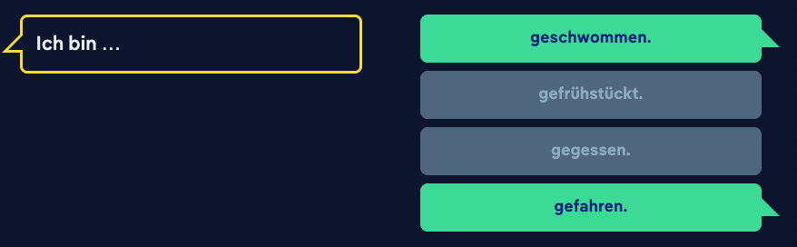

Other examples:

- Selma **ist** zur Hochzeit von ihrem Onkel nach Hamburg **gefahren**.
- Selma **ist** zusammen mit den anderen Gästen spazieren **gegangen**.
- Selma **ist** im See **geschwommen**.

For verbs of non-motion

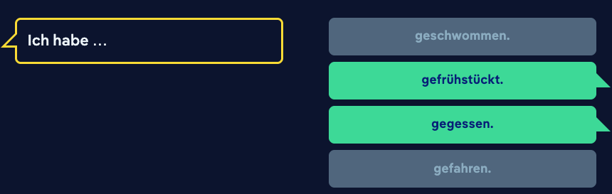

- Selma **hat** auf der Hochzeit **gegessen**, **gesungen** und **getanzt**.

**Write sentences in the present perfect:**

- Ich fahre nach Spanien.
  **Ich bin nach Spanien gefahren.**
- Was machst du in Spanien?
  **Was hast du in Spanien gemacht?**
- Schwimmst du im Meer?
  **Bist du im Meer geschwommen?**
- Wanderst du in den Bergen?
  **Bist du in den Bergen gewandert?**
- Trinkst du Wein?
  **Hast du Wein getrunken?**

## 03 Oct

### Nicosweg A1 - Chapter 13 Weather and Holiday - part 2

**Sentences:**

- Die Männer haben Nicos Tasche genommen.
  The men took Nico's bag.
- Frühling ist es wärmer [als](https://learngerman.dw.com/en/when-is-it-warmer-when-is-it-colder/l-37651758/e-37654612#) im Winter.
- Im Herbst ist es nicht so kalt wie im Winter
- Im Winter ist es kälter als im Herbst.

**Vocab:**

- Frühling = Spring
- Sommer = Summer
- Herbst = Autumn
- Winter = Winter

#### Irregular comparative and superlative

#### Regular comparative and superlative

#### Making comparisons

When we are referring to equal attributes (e.g., the same size as, as good as), we use the standard form of the adjective. The adjective is then preceded by "[genauso](https://learngerman.dw.com/en/making-comparisons/l-37651758/e-39035319#)" and followed by "[wie](https://learngerman.dw.com/en/making-comparisons/l-37651758/e-39035319#)". In the case of a direct comparison, we use "[als](https://learngerman.dw.com/en/making-comparisons/l-37651758/e-39035319#)" after the comparative adjective.

#### Comparative

Diesen Winter ist es sehr kalt. Aber im letzten Winter war es ***als*** diesen Winter. Im Jahr 2009 war es am kältesten.

#### Superlative

Morgen wird es warm. Übermorgen wird es wärmer als morgen. Aber am Wochenende wird es ***am wärmsten***.

### Comparison

**Comparative forms of** ***gut\*****,** ***gern\*****,** ***viel\***

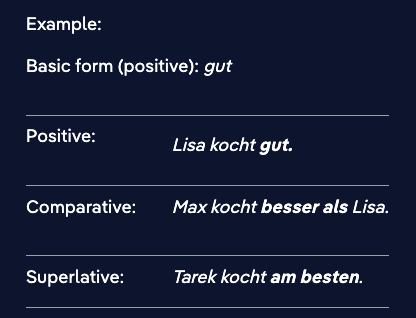

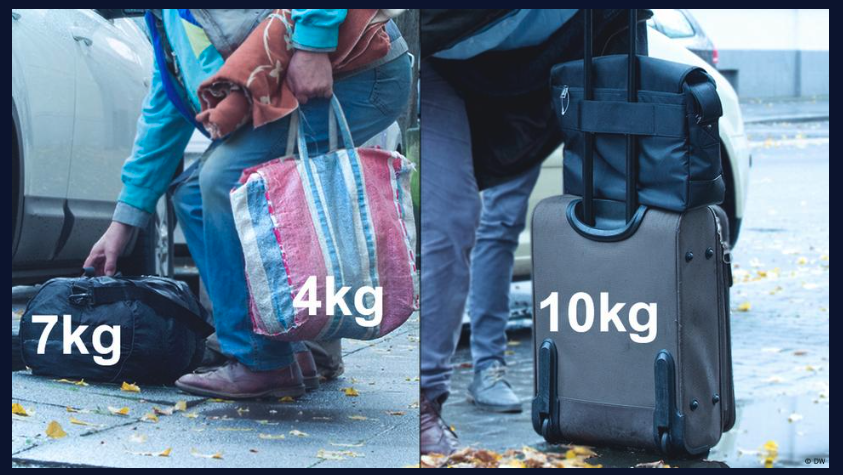

- *Die Tasche mit den Flaschen ist **schwer**.*
- *Nicos Tasche* ist **schwerer**.
- Der Koffer ist **am schwersten**

**Comparative with words containing umlauts**
Many single-syllable adjectives with the vowels *a*, *o* or *u* take an umlaut in the comparative and superlative forms. This is also true of the adjective *gesund,* though it has two syllables.

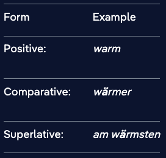

## 02 Oct

### Nicosweg A1 - Chapter 13 Weather and Holiday - part 1

https://learngerman.dw.com/en/how-was-your-vacation/l-37648534/e-37649202

**Sentences:**

- Was sagt der Mann am Telefon?
  What does the man on the phone say?
- Wo war er im Urlaub?
  Where was he on vacation?
- Im Urlaub kann man Sehenswürdigkeiten besichtigen.
  On holiday you can visit sights.
- Im Urlaub kann man am Strand faulenzen.
  On holiday you can laze on the beach.
- Ja, natürlich habe ich auch Fotos vom Hotel gemacht.
  Yes, of course I also took photos of the hotel.
- Karls Mutter faulenzt gerade.
  Karl's mother is lazing around.
- Gestern habe ich auch eine Wanderung gemacht. Das war anstrengend, aber schön!
  Yesterday I also went on a hike. That was exhausting, but nice!
- Ich mache gar nichts
  I don't do anything.

**Vocab:**

- der Strand = the beach
- die Berge = the mountain
- die Insel = the island
- Meer = more
- die Wanderung, die Wanderungen = hike; trek
- faulenze = lazing around

**Past participle:**
A regular past participle begins with "ge-", followed by the verb root and ending in "-t". 

- machen: ge-mach-t
  kochen: ge-koch-t
  faulenzen: ge-faulenz-t 

### Present perfect with "haben"

*Gestern **haben** wir eine Wanderung **gemacht**.*

This sentence is in the present perfect tense. In spoken German, this tense is generally used to express something that took place in the past.

The present perfect consists of two parts:

- In second position in the sentence there is an auxiliary verb, usually the verb *haben.* It is conjugated as in the present tense.
- The action that is being described in the sentence is expressed with the second verb, which comes at the end of the sentence. This verb takes a special form known as the past participle. Most past participles begins with the prefix *ge-**.* In present perfect sentences, the past participle is an infinitive verb form, meaning it is not conjugated.

**Present perfect:** ***haben\*** (conjugated) **+ \*past participle:\***

*Was **habt** ihr gestern **gemacht**?
Wir **haben** eine Wanderung **gemacht**.*

Grammatical terms in German:
das **Perfekt**: The present perfect is a tense used to describe the past. It comprises a conjugated auxiliary verb (*haben* or *sein*) and the past participle.

## 01 Oct

### Nicosweg A1 - Chapter 12 Food

https://learngerman.dw.com/en/mengen-und-preise/l-37628421

**Sentences:**

- Inge bekommt 1,40 Euro zurück = Inge gets 1.40 Euros back
- Was darf es sein? = What would you like?
  - Ich hätte gern 350 g Salami
- Darf es sonst noch etwas sein? = Would you like something else?
  - Ich nehme bitte noch 200 g Schinken = I'll take another 200 g of ham, please.
- Sonst noch etwas? = Anything else?
- In Deutschland gibt es mehr als 300 Brotrezepte. = There are more than 300 bread recipes in Germany.
- Wie viel kosten .. ?
- Wie teuer ist ... ?
- Was brät man nicht? = What do you not fry?
- Was backt man nicht? = What do you not bake?
- Was kochst am liebsten = 

**Vocab**:

- Pfund = ~500 grams / pound
- Metzgerei = Butcher's shop
- noch = more
- Kunde / Kundin = Customer
- Verkäufer / Verkäuferin = Salesperson
- die Zwiebel = Onion
- das Mehl = Flour
- schneiden = cut
- braten = fry
- kochen = cook
- backen = bake
- Streifen = strip, band
- am liebsten = prefer
- Tafel Schokolade = bar of Chocolate
- Dose Mais = can of corn

