# 21 Oct

## Nicosweg A1 - Chapter 16 Sports and exercise - part 2

**Sätze**:

- Pablo geht einmal pro Woche ins Fitnessstudio.
  Pablo goes to the gym once a week.
- „Pablo geht am Dienstag und am Donnerstag zum Fußballtraining.“
  "Pablo goes to soccer training on Tuesday and Thursday."
- Wann geht Pablo zum Fußballtraining?
  When does Pablo go to soccer practice?
  „Pablo geht am Dienstag und am Donnerstag zum Fußballtraining.“
- Wie lange trainiert Pablo?
  How long does Pablo train?
  „Pablo trainiert am Dienstag zwei Stunden lang und am Donnerstag auch zwei Stunden lang.“
- Wie oft macht Pablo Sport?
  How often does Pablo do sports?
  „Pablo macht dreimal pro Woche Sport.“
- Til Wagner ist Profi-Fahrradfahrer.
  Til Wagner is a professional cyclist.
- Til trainiert dreimal in der Woche mit seinem Team.
  Til trains with his team three times a week.
- Til ist seit fünf Jahren Profisportler.
  Til has been a professional athlete for five years.
- Til hat einmal bei der Tour de France mitgemacht.
  Til once took part in the Tour de France.

**Vokabeln**:

- sportlich = athletic
- entspannend = relaxing
- anstrengend = exhausting / tiring
- hat gewonnen = had won
- hat verloren = had lost

### Time specification: Wann ...?

Time is often designated in response to the question word *wann*:

*Wann spielt ihr Fußball?*

To answer with a particular hour of the day or specific time we use …

- ***um\***, when we are talking about **a point in time**:

  *Das Fußballtraining beginnt **um** zwei Uhr.*

- ***von … bis …\***, when we are talking about **a period of time**:

  *Wir spielen **von** zwei **bis** vier Uhr Fußball.*

With weekdays, we would answer with ...

- ***am\***, when speaking about a one-off event:

  *Am Freitag spielen wir Fußball.*

- With an adverb when speaking about a **regular** event:

  ***Freitags\*** *spielen wir Fußball. (= **Jeden Freitag** spielen wir Fußball.)*

- ***von ... bis ...\***, to describe **a period of time**:

  *Ich muss von Montag bis Freitag arbeiten.*

For months and seasons, we answer with ...

- ***im\*** when we are talking about **a point in time**:

  *Im Januar fahre ich Ski.*    

  *Im Sommer gehe ich regelmäßig joggen.*

- ***von … bis …\***, when we are talking about a **a period of time**:

  *Von Oktober bis April hat das Schwimmbad geschlossen.*

### Time specification: Wie oft ...?

When asking about an event or activity that is repeated, we use *wie oft*:

*Wie oft trainiert ihr?*

We often answer with ...

- the article ***jeden/jede/jedes:***

  *Wir trainieren jeden Tag/jeden Freitag. (**der** Tag -> **jeder** Tag -> a*ccusative: ***jeden** Tag)*

  *Wir trainieren jede Woche. (**die** Woche -> **jede** Woche)*

  Wir trainieren jedes Wochenende. (**das** Wochenende -> **jedes** Wochenende)

- a reference to the frequency (*einmal*, *zweimal*, *dreimal* ...) followed by the preposition ***pro\***:

  Wir trainieren zweimal pro Woche.

### Time specification: Wie lange ...?

To ask about the length of time, we use *wie lange*:

*Wie lange trainierst du?*
or:
*Wie lange dauert das Training?*

 

Often, we answer with ...

- the length of time + ***lang\***:

  *Ich trainiere eine halbe Stunde lang.*

  (The word *lang* can be left out: *Ich trainiere eine halbe Stunde.*)

- the verb ***dauern\*** + the length of time:

  *Das Training **dauert** zwei Stunden.*

# 20 Oct

## Nicosweg A1 - Chapter 16 Sports and exercise - part 1

**Sätze:**

- Mit einem Schläger kann ich …

  - Golf spielen; Tennis spielen

- Für diese Sportarten braucht man Musik: ...

  - tanzen, Aerobic machen

- **Max:** Toll! Waren die Fußbälle teuer?

  **Tarek:** Nein, die waren super billig. Ein Fußball hat 4,99 Euro gekostet – weniger als die Getränke.
  **Max:** Tja, [Verpflegung](https://learngerman.dw.com/en/how-much-does-the-soccer-ball-cost/l-37664951/e-37665371#) ist immer am teuersten.

  **Max**: Great! Were the footballs expensive?
  **Tarek**: No, they were super cheap. A football cost 4.99 euros – less than the drinks.
  **Max**: Well, food is always the most expensive.

- Nico muss Sportschuhe, Getränke und etwas zu essen mitnehmen.
  Nico has to take sports shoes, drinks and something to eat with him.

- Wer nimmt den Ball mit?
  Who will take the ball?

  Sebastian nimmt den Ball mit.
  Sebastian takes the ball with him.

**Vokabeln:**

- schläger = racket / bat
- Verpflegung = meals
- teuer = expensive
- billig = cheap
- weniger = less than / cheaper
- Klettern = climb
- Hälse = neck
- Bäuche = belly
- Bein = leg
- Zeh = toe

### Is the soccer ball more expensive or cheaper than …?

Do you remember how to form the **comparative** and the **superlative**? Insert the appropriate forms of "billig" and "teuer".

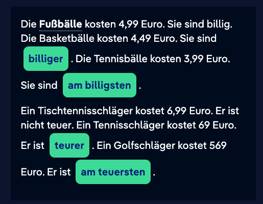

### Parts of the body

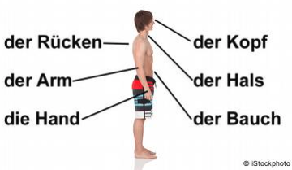

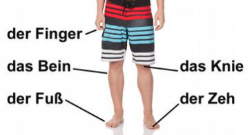

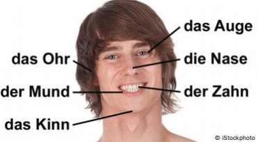

### Comparison (3)

**Regular comparatives**
Regular comparatives are formed as follows:

**Positive**: basic form (e.g. *billig*)
**Comparative**: adjective + *-**er*** (e.g. *billig**er***)
**Superlative**: ***am\*** + adjective + ***-sten\*** (e.g. ***am\*** *billig**sten***)

*Die Fußbälle sind billig.
Die Basketbälle sind billig**er**.
Die Tennisbälle sind **am** billig**sten**.* 

**Irregular comparatives: adjectives ending in \*-el\* and \*-er\***

All adjectives that end in *-el* and many adjectives that end in *-er* lose the *e* before the comparative ending. The superlative construction, however, is regular.

- *dunk***e***l <* **dunkler** *< am dunk***e***lsten*
- *teu***e***r <* **teurer** *< am teu***e***rsten*

 

*Der Tischtennisschläger ist nicht **teuer**.
Der Tennisschläger ist **teurer**.
Der Golfschläger ist **am teuersten**.*

 Grammatical terms in German:der Positiv: The positive is the basic form of the adjective. We use it to describe qualities of people or things. der Komparativ: The comparative is the ranking of an adjective that compares two things to express a difference, e.g. *schneller*, *wärmer*, *besser*.der Superlativ: The superlative is the highest form of an adjective comparison. It describes the greatest degree of a particular quality, e.g. *am schnellsten*, *am wärmsten*, *am besten*.

# 19 Oct

## Nicosweg A1 - Chapter 15 Family - part 4

learn via mobile

Ruft Nico seinen Bruder an?
Is Nico calling his brother?

**Vokabeln**

- Einzelkind = only child
- Rauchen = smoke
- aufräumen = clean up
- Hund füttern = dog feeding
- den Boden putzen = The floor cleaning

**Sollen:**

- du sollst
- er/sie/es sol
- ich soll
- ihr sollt
- Sie/sie sollen
- wir sollen

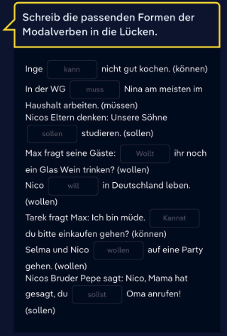

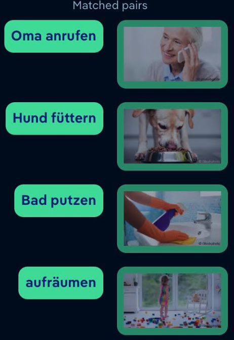

# 18 Oct

## Nicosweg A1 - Chapter 15 Family - part 3

**Sätze:**

- Max soll Yaras Blumen gießen.
  Max is supposed to water Yara's flowers.
- Yara legt auf.
  Yara hangs up.
  - New words: "auflegen" is a separable verb and means "to end a call".
- Immer mehr Frauen arbeiten in Männerberufen.
  More and more women are working in male professions.
- In der Bäcker-Ausbildung gibt es immer mehr Frauen.
  There are more and more women in baker training.
- Es gibt mehr Friseurinnen als Friseure.
  There are more hairdressers than hairdressers.
- Yara hat einen typischen Männerberuf.
  Yara has a typical male profession.

**Vokabeln**:

- zwei Wochen vorher = two weeks before
- New words: "auflegen" is a separable verb and means "to end a call".
- weiblich = female / feminine
- die Auszubildende, die Auszubildenden = apprentice; trainee (female)

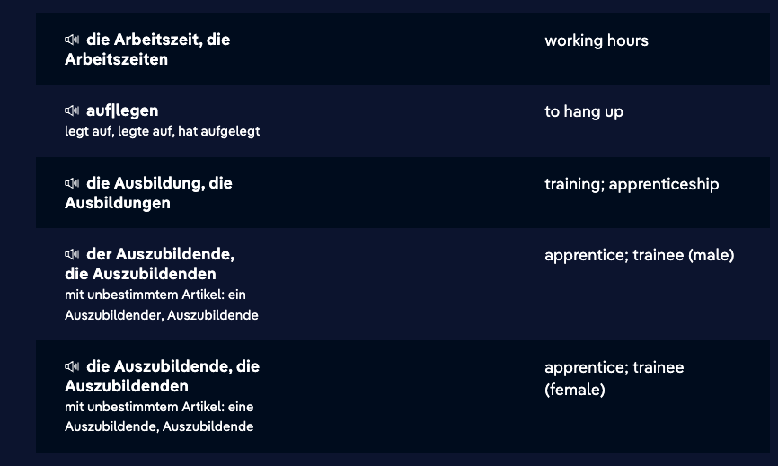

## My dear granddaughter

Yara's family was very disappointed when she moved to Germany. Her grandpa wrote her a letter, but it's missing the possessive determiners. Do you remember all the forms? Complete the letter by selecting the correct missing forms.

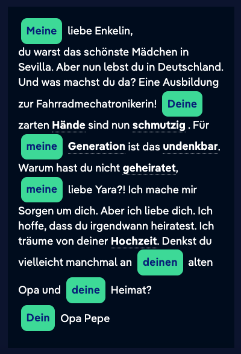

## We like our jobs

Review what you've learned about possessive determiners. Write the missing words in the blank spaces.

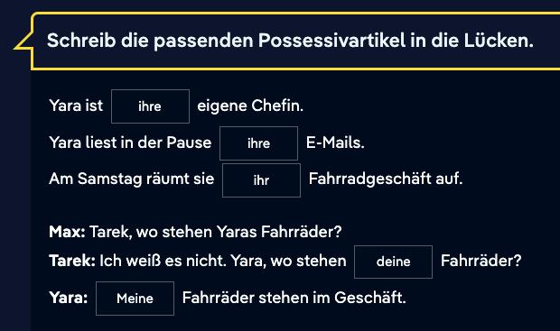

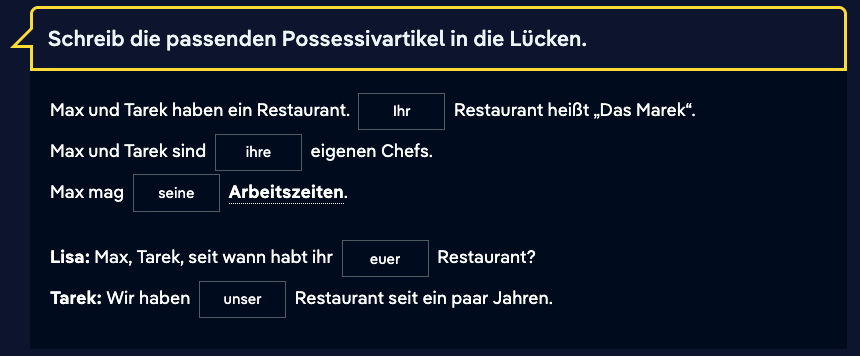

## Guess the profession (1)

Which profession matches the description? When choosing your answer, pay attention to whether you need to use the masculine or feminine term.

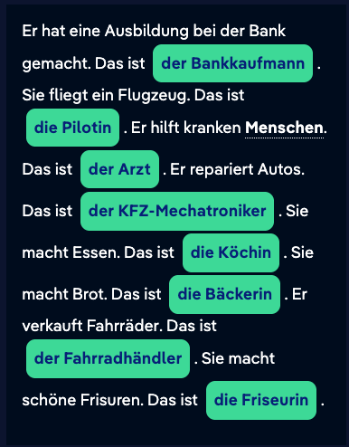

## The possessive determiner

**Revision: the possessive determiner**

*Ich habe **meinen** Bruder angerufen. Aber **mein** Bruder kann nicht kommen.*

To express ownership or possession, we use the possessive determiner, rather than the indefinite article.

Here is an overview of the pronouns and their corresponding possessive determiners:

| Pronoun | Possessive |
| ------- | ---------- |
| ich     | mein       |
| du      | dein       |
| er/es   | sein       |
| sie     | ihr        |
| wir     | unser      |
| ihr     | euer       |
| sie     | ihr        |
| Sie     | Ihr        |

**Revision: declension of the possessive determiner**

The ending of the possessive determiner in the singular is identical to the ending of the indefinite article:

- In the nominative and accusative, the possessive determiner takes the ending *-e* when it comes before a feminine noun or a plural noun.
- In the accusative, the possessive determiner takes the ending *-en* when it comes before a masculine noun. 

Personal pronoun: *ich*
Possessive determiner: *mein*

| Nominative                                                 | Accusative                                                   |
| ---------------------------------------------------------- | ------------------------------------------------------------ |
| mein Bruder mein**e** Schwester mein Kind mein**e** Eltern | mein***en\*** Bruder mein**e** Schwester mein Kind mein**e** Eltern |

masculine:
*mein Bruder* (Nominative)
*mein**en** Bruder* (Accusative)

feminine:
*mein***e** *Schwester* (Nominative and Accusative)

neuter:
*mein Kind* (Nominative and Accusative)

plural:
*mein***e** *Eltern* (Nominative and Accusative)

Personal pronoun: *ihr*
Possessive determiner: *euer*

Pay attention to the irregular form of *euer* and the ending:

| Nominative                                                   | Accusative                                                   |
| ------------------------------------------------------------ | ------------------------------------------------------------ |
| euer Bruder ***eure*** Schwester euer Kind ***eure*** Eltern | ***euren*** Bruder ***eure*** Schwester euer Kind ***eure*** Eltern |

masculine:
*euer Bruder* (Nominative)
***euren\*** *Bruder* (Accusative)

feminine:
***eur\*****e** *Schwester* (Nominative and Accusative)

neuter:
*euer Kind* (Nominative and Accusative)

plural:
***eur\*****e** *Eltern* (Nominative and Accusative)

Grammatical terms in German:der Possessivartikel: The possessive determiner is an article that expresses ownership or possession.

# 17 Oct

## Nicosweg A1 - Chapter 15 Family - part 2

**Sätze:**

- Nicos Eltern wohnen in Sevilla. Sein Vater ist **Anwalt** von Beruf. Seine Mutter ist **Ingenieurin**. Nicos Eltern und Yara haben nur **wenig** [Kontakt](https://learngerman.dw.com/en/nicos-parents/l-37664246/e-37664719#). Auch Nico möchte seine Eltern **nicht anrufen.**
  Nico's parents live in Seville. His father is a **lawyer** by profession. His mother is an **engineer**. Nico's parents and Yara have **little** contact. Nico **doesn't want to call** his parents either.

- Nico sieht Emma. Emma fragt: „Rufst du mich heute an?“
  Nico sagt zu Emma: „Ich rufe dich heute an.“

  Nico sees Emma. Emma asks, "Are you calling me today?"
  Nico says to Emma: "I'll call you today."

- ich kenne dich
  I know you

**Vokabeln:**

- Polizist = police
- Meine Eltern / Meine Schwester
- Mein Vater / Mein Mutter / Mein Bruder
- die Geschwister = the siblings
- die Nichten = the nieces
- *alleinerziehende Mutter* (single mother) 
- *alleinerziehender Vater* (single father)
- *gleichgeschlechtliche Partnerschaft* (same-sex partnership)
- *Wochenendfamilie* (weekend family) 

### Personal pronouns in the accusative (1)

What are the personal pronouns in the accusative? Read the rule and complete the example sentences.

First-person singular: Nominative: "ich" – Accusative: "mich"

Second-person singular: Nominative: "du" –  Accusative: "dich"

Third-person singular masculine: Nominative: "er" –  Accusative: "ihn"

Third-person singular feminine: Nominative: "sie" –  Accusative: "sie"

Third-person singular neuter: Nominative: "es" –  Accusative: "es"

Third-person plural: Nominative: "sie" – Accusative: "sie"

Second-person singular/plural (formal): Nominative: "Sie" –  Accusative: "Sie"

So what about "wir" and "ihr"? You'll learn this in the following exercises.

Nico ruft **Max** an. Nico ruft **ihn** an.
Nico ruft **Emma** an. Nico ruft **sie** an.
Nico ruft **das Kind** an. Nico ruft **es** an.

- ruft - an = calling

Nico ruft **Emma und Lisa** an. Nico ruft **sie** an.
Nico sagt: „**Frau Reimann,** ich rufe **Sie** morgen an.“

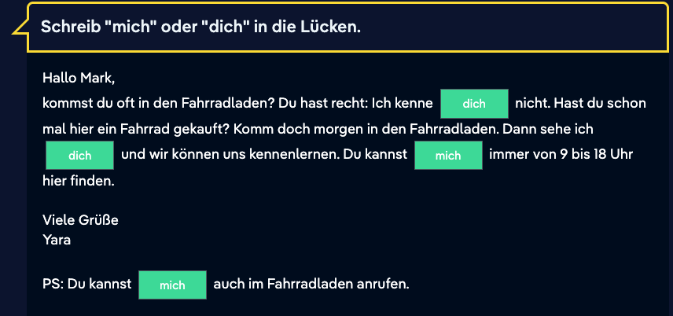

### Akkusativ

wir - uns

ihr - euch

### For Whom

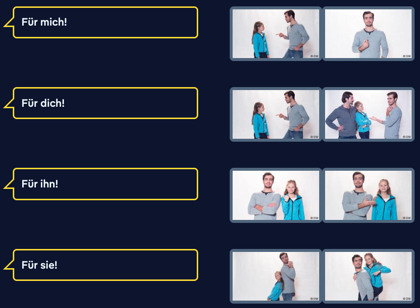

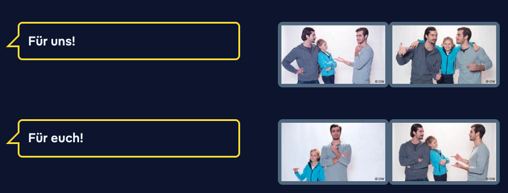

### Personal pronouns: accusative

#### **Personal pronouns in the accusative**

*Wo ist **der Schlüssel** von Yaras Geschäft? – **Er** ist bei Max und Tarek.*

*Haben Max und Tarek **den Schlüssel** von Yaras Geschäft? – Ja, sie haben **ihn**.*

Every noun can be substituted with a pronoun. The personal pronoun can represent a person or thing. Every pronoun can take the nominative or any of the other cases. For example, when a personal pronoun comes after a preposition or a verb that takes the accusative, it will also be in the accusative.

Most personal pronouns in the accusative have a different form from the nominative, but some stay the same.

| Nominative | Accusative  |
| ---------- | ----------- |
| ich        | ***mich\*** |
| du         | ***dich\*** |
| er         | ***ihn\***  |
| sie        | *sie*       |
| es         | *es*        |
| wir        | ***uns\***  |
| ihr        | ***euch\*** |
| sie        | *sie*       |
| Sie        | *Sie*       |

### Prepositions: für

*Ich habe ein Geschenk für **dich**. Hier, ein Notizbuch. Für **alle neuen Wörter** auf Deutsch.*

The preposition *für* is used, for example, to describe the recipient, goal or purpose of an activity. It takes the accusative. Pronouns or nouns that follow *für* are in the accusative.

# 16 Oct

## Nicosweg A1 - Chapter 15 Family - part 1

**Sätze:**

- Sie sucht ihr Portemonnaie.
  She is looking for her wallet.
- die Cousinen von Selma.
  the cousins of Selma.
- Selma hat zwei Brüder: Khalil und Safi. Sie sind die von Selma.
  Selma has two brothers: Khalil and Safi. They are Selma's.
- Die Schwester von Selmas Vater ist Selmas .
  Selma's father's sister is Selmas.
- Liegt es auf **dem** Stuhl? - Dativ
  Is it lying on a chair?
- Liegt es hinter **dem** Bett? - Dativ
  Is it behind bed?
- Ist es in **der** Hosentasche? - Dativ
  Is it in your pocket?

**Vokabeln:**

- Portemonnaie = wallet
- Großeltern = grandparents
- Geschwister = siblings
- ledig = single
- verheiratet = married

### Family Tree

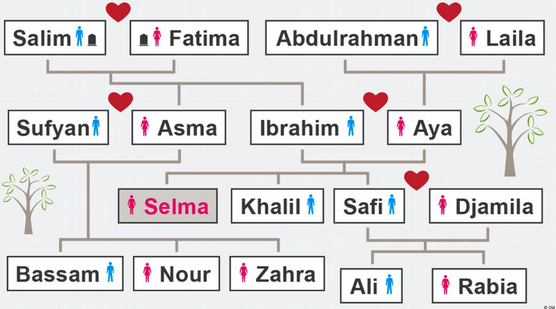

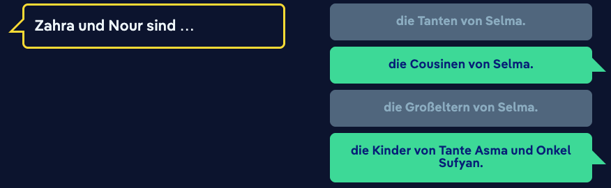

### Merge words

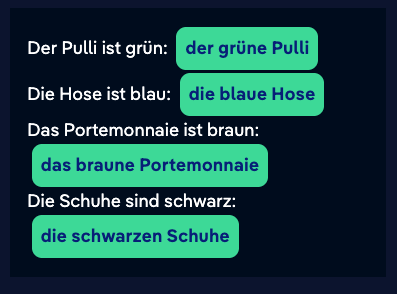

### Adjectives preceded by the definite article (accusative)

In German, lots of verbs are followed by the accusative case. The adjective in the accusative form must have an accusative ending. Read the rule and choose the correct ending.

Adjectives following the definite article in the **accusative**: 
With singular feminine and neuter nouns, the adjectival ending after a definite article in the accusative is "-e".
With masculine nouns and plural nouns, the adjectival ending after a definite article in the accusative is "-en".

Have you noticed something? The feminine and neuter adjectival endings are the same in the nominative and accusative. Here, the ending is always "-e".

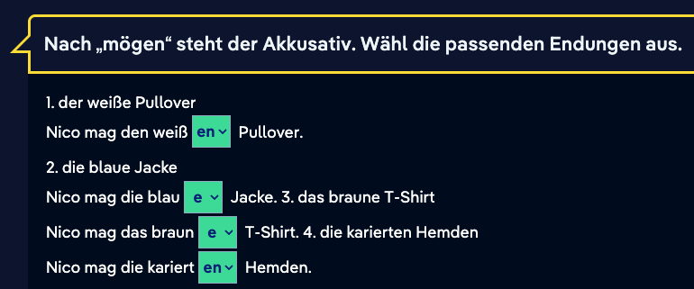

### Adjective declension (2)

An adjective can directly precede the noun it describes. In this case, the adjectival ending changes to match that of the noun it precedes. This is called adjective declension. There are three different declensions. The declension to use depends on the article that precedes the noun: the indefinite article, the definite article or no article.

**Adjective declension after a definite article**

*Inge schenkt Nico* **ein** *gestreift***es** *Hemd. – Nico findet* **das** *gestreift***e** *Hemd nicht so schön.*

If there is an **indefinite article** before the noun, then the adjective (in the nominative and accusative cases) takes the ending of the definite article.

But when there is a **definite article** before the noun, the adjective only takes the ending *-e* or *-en*.

 Masculine: 
*der schick**e** Pullover* (nominative)
*den schick**en** Pullover* (accusative)
Feminine:
*die schicke Hose* (nominative and accusative)
Neuter:
*das schick**e** Hemd* (nominative and accusative)
Plural:
*die schick**en** Schuhe* (nominative and accusative)

In the accusative case, the adjective before a masculine noun takes the ending *-en*.
Adjectives before plural nouns also take the ending *-en*.

 

**Adjective declension after the possessive determiner or the negative article**

Adjectives before a noun with a possessive determiner (i.e., *mein*, *dein*, *sein* …) or a negative article (*kein*) are declined as follows:

- in the **singular**, the same as the adjective declension after an **indefinite** article.
- in the **plural**, the same as the adjective declension after a **definite** article.

 Masculine:
*kein schick**er** Pullover* (nominative)
*keinen schick**en** Pullover* (accusative)
Feminine:
*keine schick**e** Hose* (nominative and accusative)
Neuter:
*kein schick**es** Hemd* (nominative and accusative)
Plural:
*keine schick**en** Schuhe* (nominative and accusative)

Grammatical terms in German:der bestimmte Artikel: The articles *der*, *die*, *das* are definite articles.der unbestimmte Artikel: The articles *ein*, *eine* are indefinite articles.

### Two-case prepositions

#### **Revision: two-case prepositions**

There are nine prepositions that can take either the dative or the accusative case: *in*, *an*, *unter*, *über*, *auf**,* *vor*, *hinter*, *neben* and *zwischen*.

These prepositions take the dative in answer to the question *Wo …?*

*Wo ist Selmas Portemonnaie? – Selmas Portemonnaie ist ...*

| Preposition | + Dative         |
| ----------- | ---------------- |
| ... auf     | **dem** Stuhl.   |
|             | **der** Tasche.  |
|             | **dem** Bett.    |
|             | **den** Büchern. |

 

Some prepositions and articles are contracted when used together:

*in + dem = im
an + dem = am*

# 15 Oct

## Nicosweg A1 - Chapter 14 Clothing - part 4

**Sätze:**

- Inge zeigt Nico Kleidung von Günther.
  Inge shows Nico Günther clothes.
- Nico probiert die Sachen von Günther an.
  Nico tries on Günther's clothes.
- Ich finde, du bist ein [hübscher](https://learngerman.dw.com/en/youre-a-good-looking-young-man/l-37661765/e-37662029#) [junger](https://learngerman.dw.com/en/youre-a-good-looking-young-man/l-37661765/e-37662029#) Mann. 
  I think you're a handsome young man.
- Ein gestreiftes **Hemd** und eine warme **Hose**. Und ganz schicke **Schuhe**.
  A striped **shirt** and warm **pants**. And very chic **shoes**.
- Emma trägt ein gepunktetes Halstuch.
  Emma wears a polka dot scarf.
- Eine Ärztin trägt oft …
  A doctor often wears ...
- Bei der Arbeit trägt sie gern Kleider.
  She likes to wear clothes at work.
- Im Büro tragen viele Menschen [formelle ](https://learngerman.dw.com/en/what-do-people-wear-at-the-office/l-37661765/e-37664214#)**Kleidung**. Männer tragen schicke **Schuhe**, ein **Hemd** in Blau oder Weiß und eine gute Hose. Bei großen [Unternehmen ](https://learngerman.dw.com/en/what-do-people-wear-at-the-office/l-37661765/e-37664214#)gehört elegante **Kleidung** zum Alltag. Dann tragen Männer immer einen [Anzug ](https://learngerman.dw.com/en/what-do-people-wear-at-the-office/l-37661765/e-37664214#)mit **Krawatte**.
  
  In the office, many people wear formal **clothing**. Men wear smart **shoes**, a **shirt** in blue or white and good trousers. At large companies, elegant **clothing** is part of everyday life. Then men always wear a suit with a **tie**.
  
- Frauen können ein schickes [Kostüm](https://learngerman.dw.com/en/what-do-people-wear-at-the-office/l-37661765/e-37664214#) oder einen eleganten Hosenanzug wählen. Meist ziehen sie dazu [hohe](https://learngerman.dw.com/en/what-do-people-wear-at-the-office/l-37661765/e-37664214#) Schuhe an. Aber auch eine Bluse und eine Hose oder einen Rock tragen Frauen gern bei der Arbeit. Im Büro sieht man selten [grelle](https://learngerman.dw.com/en/what-do-people-wear-at-the-office/l-37661765/e-37664214#) Farben. Die Kleidung ist insgesamt eher [schlicht](https://learngerman.dw.com/en/what-do-people-wear-at-the-office/l-37661765/e-37664214#) und dunkel: Blau, Grau und Schwarz kombiniert mit Weiß oder Hellblau.
  Women can choose a chic costume or an elegant pantsuit. They usually put on high heels. But women also like to wear a blouse and trousers or skirt to work. In the office, you rarely see bright colors. Overall, the clothing is rather simple and dark: blue, gray and black combined with white or light blue.

**Vokabeln:**

- überraschung = suprise
- trägt = wear
- weste = vest
- fliege = bow tie
- hoch = tall, high
- der Handschuh = glove
- das Halstuch = scarf
- geblümt = flowery, floral
- gepunktet = polka-dotted, spotted
- gestreift = striped
- grell = bright, glaring

### Akkusativ

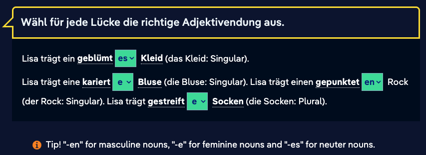

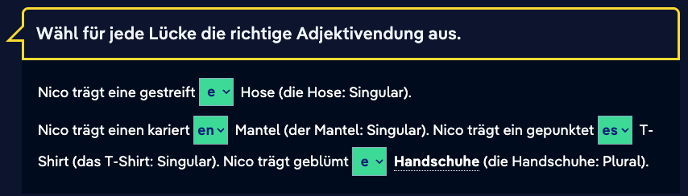

### Akkusativ oder Nominativ

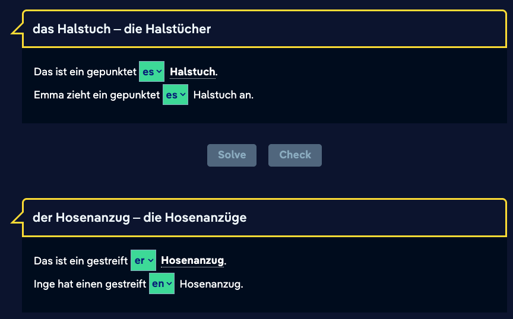

### Indefinite Article and Matching Color

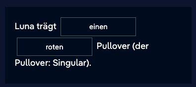

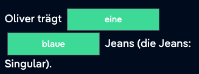

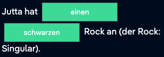

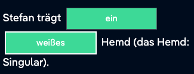