# Day 31

## Nicosweg A1 - Chapter 18 Home - part 4

Sätze:

- Nico wünscht sich einen Fahrradladen.
  Nico wants a bike shop.

Vokabeln:

- wünscht = wants

## Dreams for the future

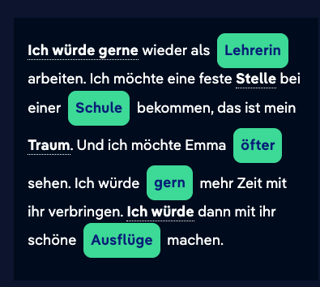

I would like to work as a teacher again. I want to get a permanent job at a school, that's my dream. And I want to see Emma more often. I would like to spend more time with her. I would then go on nice trips with her.

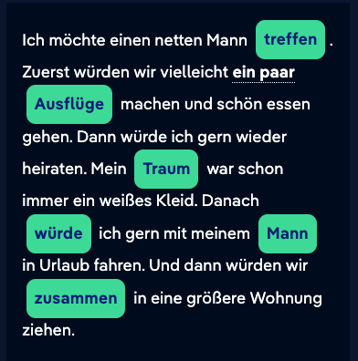

I want to meet a nice man. First, we might go on a few trips and have a nice meal. Then I would like to marry again. My dream has always been a white dress. After that, I would like to go on vacation with my husband. And then we would move into a bigger apartment together.

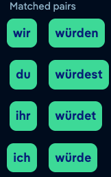

## Subjunctive: Wishes (1)

When we are talking about a situation that is not real, we use a special form of the verb known as the subjunctive. We use this form, for example, to express wishes.

real: *Ich **habe** keinen eigenen Fahrradladen.*

wish: *Ich **hätte** gern einen eigenen Fahrradladen.*

The past subjunctive of "haben" is conjugated as follows:

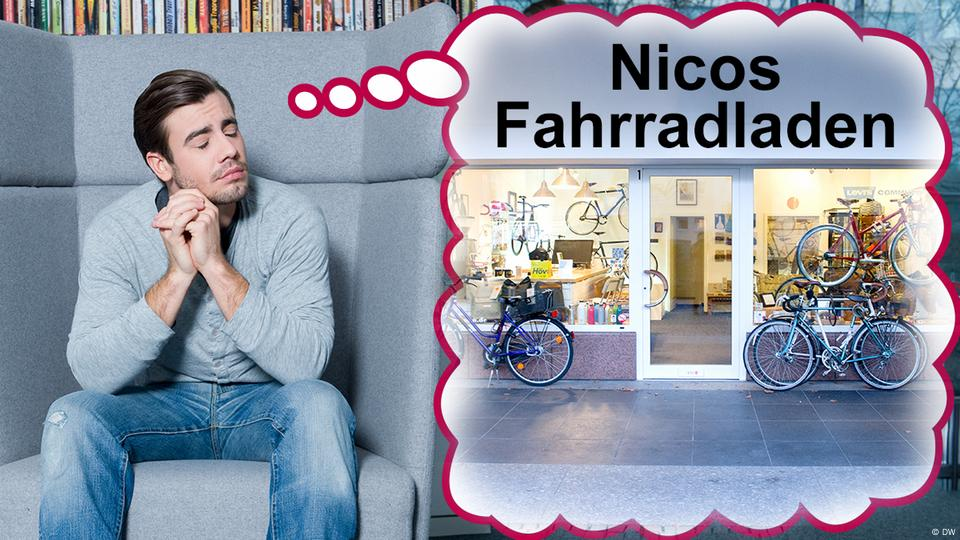

| *Singular* |                       |
| ---------- | --------------------- |
| 1st person | *ich hätte*           |
| 2nd person | *du hättest*          |
| 3rd person | *er/sie/es/man hätte* |
| *Plural*   |                       |
| 1st person | *wir hätten*          |
| 2nd person | *ihr hättet*          |
| 3rd person | *sie hätten*          |
| *Formal*   | *Sie hätten*          |

Grammatical terms in German:der Konjunktiv II: The subjunctive is a verb form that is used to express something that is not real but is a fantastical proposition. It is used, for example, to express a wish or a requirement that is unrealistic. It is also used to ask a favor of someone or to make a proposal in a polite manner.

## Subjunctive: Wishes (2)

In order to express who, what, or how someone wants something, we use a form of the verb *sein* called the subjunctive.

real: *Ich **bin** nicht verheiratet.*

wish: *Ich **wäre** gern verheiratet.*

The past subjunctive of "sein" is conjugated as follows:

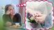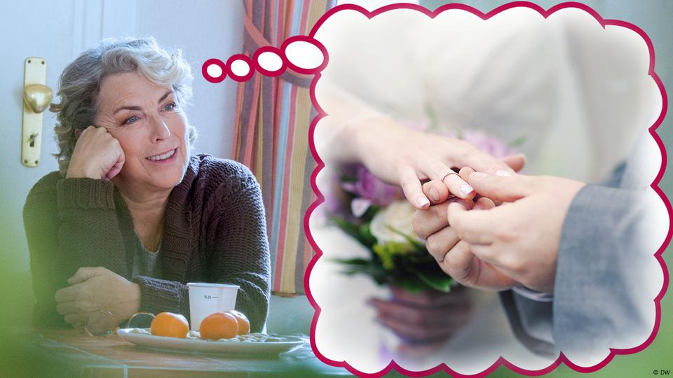

| *Singular* |                         |
| ---------- | ----------------------- |
| 1st person | *ich wäre*              |
| 2nd person | *du wärst (du wärest)** |
| 3rd person | *er/sie/es/man wäre*    |
| *Plural*   |                         |
| 1st person | *wir wären*             |
| 2nd person | *ihr wärt (ihr wäret)** |
| 3rd person | *sie wären*             |
| *Formal*   | *Sie wären*             |

*Two forms exist here; the form in the brackets is rarely used.

## Subjunctive: Wishes (3)

We can make a form of the subjunctive from any verb. However, in everyday language we only make the subjunctives of *haben*, *sein* and the modal verbs. With other verbs, we use the form *würde* + the infinitive.

real: Selma ***besucht\*** ihre Großeltern nicht.

wish: Selma **würde** gern ihre Großeltern **besuchen**.

real: Emma ***isst\*** kein Eis.

wish: Emma **würde** gern ein Eis **essen**.

The subjunctive *würde* is conjugated but the second verb does not change: 

| *Singular* |                       |
| ---------- | --------------------- |
| 1st person | *ich würde*           |
| 2nd person | *du würdest*          |
| 3rd person | *er/sie/es/man würde* |
| *Plural*   |                       |
| 1st person | *wir würden*          |
| 2nd person | *ihr würdet*          |
| 3rd person | *sie würden*          |
| *Formal*   | *Sie würden*          |

# Day 30

## Nicosweg A1 - Chapter 18 Home - part 3

Vokabeln:

- genause = equally

**Selma:** Wir essen viel Fleisch. Bei uns gibt es nicht viele Vegetarier. Aber vor allem gibt es in Syrien nicht so viele [Regeln](https://learngerman.dw.com/en/just-as/l-37779968/e-37781605#) wie in Deutschland. Und es gibt viel mehr Leben auf der Straße, besonders am Abend. Die Läden sind länger geöffnet, die Menschen sind draußen, alles ist ein bisschen [spontaner](https://learngerman.dw.com/en/just-as/l-37779968/e-37781605#) und [lockerer](https://learngerman.dw.com/en/just-as/l-37779968/e-37781605#). Ja, eigentlich ist fast alles anders, aber ich finde, die Menschen hier in Deutschland sind genauso nett wie die Menschen in Syrien.

Selma: We eat a lot of meat. We don't have many vegetarians. But above all, there are not as many rules in Syria as in Germany. And there is much more life on the street, especially in the evening. The shops are open longer, people are outside, everything is a bit more spontaneous and relaxed. Yes, almost everything is different, but I think the people here in Germany are just as nice as the people in Syria.

## Comparisons with "als" and "wie"

Do you still remember how to form comparisons using "als" and "wie"? Read the summary. Then select the fitting word for each sentence.

When two people or things are different, you say:
Adjective (comparative) + "als":
Lisa singt **besser als** Selma.

When two people or things are the same, you say: 
"genauso" + adjective (in its simple form) + "wie":
Selma singt **genauso gut wie** Nina.

Das Leben in Syrien ist anders in Deutschland. In Syrien essen wir viel mehr Fleisch in Deutschland. Wir kaufen auch öfter auf Märkten ein in Deutschland. Und die Geschäfte in Deutschland haben nicht so lange geöffnet in Syrien. Die syrischen Geschäfte haben meistens keine festen Öffnungszeiten. Die Menschen hier sind genauso nett und [hilfsbereit](https://learngerman.dw.com/en/germany-is-different-from-syria-1/l-37779968/e-37783066#) zu Hause, aber in Syrien ist man viel spontaner in Deutschland. Deutsch lernen ist nicht [einfach](https://learngerman.dw.com/en/germany-is-different-from-syria-1/l-37779968/e-37783066#), aber ich glaube, Arabisch ist genauso schwer Deutsch.

Life in Syria is different in Germany. In Syria we eat much more meat, in Germany. We also shop more often at markets in Germany. And the shops in Germany are not open for so long in Syria. The Syrian shops usually do not have fixed opening hours. The people here are just as nice and helpful at home, but in Syria people are much more spontaneous in Germany. Learning German is not easy, but I think Arabic is just as difficult German.

# Day 29

## Nicosweg A1 - Chapter 18 Home - part 2

Sätze:

- Schmekt wie im Spanien
  Taste like in Spain
- Was vermisst Nico?
  What does Nico miss?
- Nico vermisst das spanische Wetter.
  Nico misses the Spanish weather.
- Ja,das Essen aus meiner Heimat fehlt mir.
  Yes, the food from my home country is missing.
- Nein, meine Freunde fehlen mir nicht.
  No, I don't miss my friends.
- Ja, das Leben in Deutschland gefällt mir gut.
  Yes, I like life in Germany.
- Tarek findet Lebensmittel in Deutschland teuer.
  Tarek thinks **food** is **expensive** in Germany.

Vokabeln:

- Heimweh = homesickness
- Heimat = home / native land
- Lieblingsessen = favourite food

## Enjoy your meal!

You already know the dative. Now you will learn the personal pronouns in the dative. First read the rule. Then select the correct personal pronoun for each sentence.

Personal pronouns in the dative

You already know that certain verbs and prepositions take the dative. Not just nouns, but also personal pronouns can be declined in the dative, for example after the verb “schmecken”.

masculine: Schmeckt die Paella **Nico**? – Ja, die Paella schmeckt **ihm**.

feminine: Schmeckt die Paella **Inge**? – Ja, die Paella schmeckt **ihr**.

neutral: Schmeckt die Paella **dem Kind**? – Ja, die Paella schmeckt **ihm**.

## What do you recommend?

You will find additional personal pronouns in the dative in this conversation between Inge and Nico. Read the rule and select the fitting pronouns.

In the first and second person singular, the dative personal pronouns are "mir" and "dir":

**Nico:** Schmeckt **dir** die Paella?
**Inge:** Ja, sie schmeckt **mir** sehr gut.

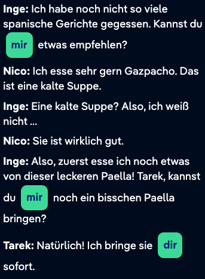

## Personal pronouns in the dative (1)

Match the personal pronouns in the nominative with their corresponding dative forms

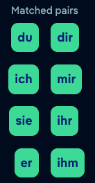

## What do you miss? (1)

Tarek and Nico are talking about their home countries, comparing life there with life in Germany. Read the rule and complete the dialogue by filling in the blanks.

The verbs "[vermissen](https://learngerman.dw.com/en/what-do-you-miss-1/l-37777069/e-37778301#)" and "[fehlen](https://learngerman.dw.com/en/what-do-you-miss-1/l-37777069/e-37778301#)" have a similar meaning. But the sentence structure required by these two verbs is different:

“vermissen” is used with the accusative:
Ich vermisse **meinen besten Freund**.

“fehlen” is used with the dative:
Mein bester Freund fehlt **mir**.

The same is true of the verbs "[mögen](https://learngerman.dw.com/en/what-do-you-miss-1/l-37777069/e-37778301#)" and "[gefallen](https://learngerman.dw.com/en/what-do-you-miss-1/l-37777069/e-37778301#)":
Ich mag **den Frühling in Deutschland.**
Der Frühling in Deutschland gefällt **mir**.

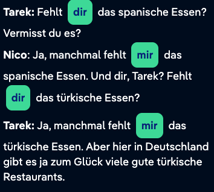

Tarek: Do you miss the Spanish food? Do you miss it?
Nico: Yes, sometimes I miss the Spanish food. And you, Tarek? Do you miss the Turkish food?
Tarek: Yes, sometimes I miss the Turkish food. But here in Germany, fortunately, there are many good Turkish restaurants.

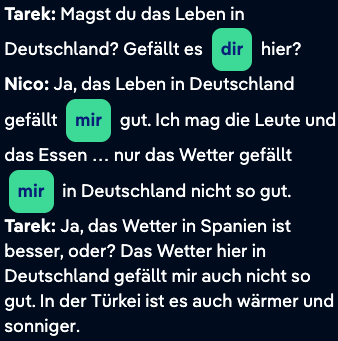

Tarek: Do you like life in Germany? Do you like it here?
Nico: Yes, I like life in Germany. I like the people and the food... only I don't like the weather so much in Germany.
Tarek: Yes, the weather in Spain is better, isn't it? I don't like the weather here in Germany so much either. It is also warmer and sunnier in Turkey.

## Personal pronouns in the dative (2)

Nico and Inge have eaten a lot of Paella. Tarek comes to their table again. Read the dialogue and pay close attention to the personal pronouns. Then match the pronouns in the nominative with their corresponding dative form.

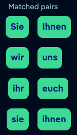

## Tarek, please bring us...

Tarek has too much to do. Read the dialogue and select the correct personal pronouns.

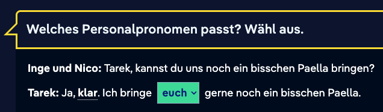

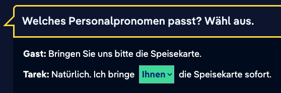

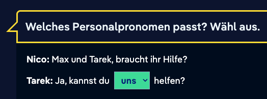

## Say it differently

Read through the sentences. You can say the same thing in many different ways. Fill in the gaps with the correct personal pronouns.

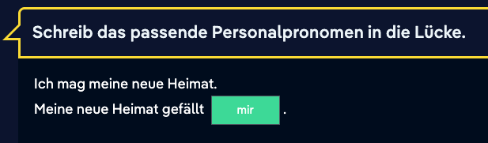

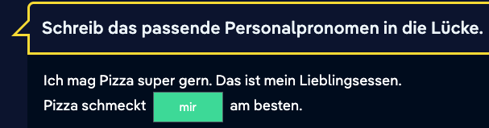

## Personal pronouns: dative

**Personal pronouns in the dative case**

Personal pronouns can take the nominative case and other cases as well; for example a personal pronoun can be used after certain prepositions or verbs in the accusative. Other prepositions or verbs take the dative.

Nominative: *Vermisst **du** spanisches Essen?*

Accusative: *Wir haben für **dich** Paella gekocht.*

Dative: *Schmeckt **dir** die Paella?*

| Nominative | Accusative | Dative |
| ---------- | ---------- | ------ |
| ich        | mich       | mir    |
| du         | dich       | dir    |
| er         | ihn        | ihm    |
| sie        | sie        | ihr    |
| es         | es         | ihm    |
| wir        | uns        | uns    |
| ihr        | euch       | euch   |
| sie        | sie        | ihnen  |
| Sie        | Sie        | Ihnen  |

## Verbs with a dative object (2)

A few German verbs are used with a dative object, often the recipient or goal of an action, and quite often a person.

Examples:

*Der junge Mann* hilft ***der alten Frau\***.
*Er* hilft ***ihr\***.

Subject: *der junge Mann = er*
Dative object: ***der alten Frau = ihr\***

Further examples:

*Die Hose* passt ***dem Mann\****.
Sie* passt ***ihm\***.

*Das Essen* schmeckt ***den\* \*Kindern\***.
*Es* schmeckt ***ihnen\***.

*Ihre Familie* fehlt ***der Frau\***.
*Sie* fehlt ***ihr\***.

*Das Zimmer* gefällt ***der Studentin\***.
*Es* gefällt ***ihr\***.

## Prepositions + dative

**Summary: Prepositions with the dative case**

Some prepositions are always followed by the dative. You already know the following ones:

***aus\****: Tarek kommt **aus der Türkei**.*

***nach\****: **Nach dem Essen** lerne ich Deutsch.*

***von\****: Das Haus ist in der Nähe **vom Bahnhof**. (vom = von + dem)*

***bei\****: Selma wohnt **bei ihnen**.*

***zu\****: Nico geht **zum Deutschkurs**. (zum = zu + dem)*

***mit\****: Nico fährt **mit dem Bus**.*

***ab\****: Tarek hat **ab dem ersten Februar** eine Woche Urlaub.*

Two-case prepositions take the dative case when they are used to answer the question *Wo ...?*:

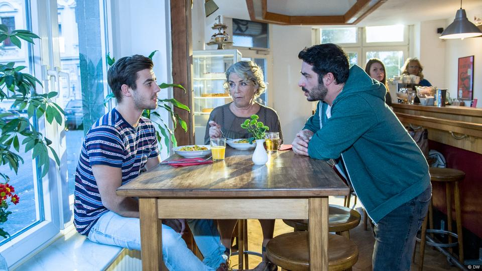

***in\****: Nico, Inge und Tarek sind **im Restaurant**. (im = in + dem)*

***an\****: Nico und Inge sitzen **am Tisch**. (am = an + dem)*

***unter\****: Nicos Füße sind **unter dem Tisch**.*

***über\****: Die Lampe hängt nicht **über dem Tisch** von Nico und Inge.*

***auf\****: Das Essen steht **auf dem Tisch**.*

***vor\****: Die Blumenvase steht **vor dem Teller** von Inge.*

***hinter\****: Das Kuchenregal steht **hinter dem Stuhl** von Inge.*

***neben\****: Nicos Messer liegt **neben dem Teller**.*

***zwischen\****: Der Orangensaft steht **zwischen dem Teller und der Blumenvase**.*

# Day 28

## Nicosweg A1 - Chapter 18 Home - part 1

Sätze:

- Wir haben einen Papagei. Der Papagei heißt Leli.
  We have a parrot. The parrot's name is Leli.
- Wir haben in der Wohnung übernachtet.
  We spent the night in the apartment.

## Adjective endings (1)

Do you still remember all of the adjective endings used with definite and indefinite articles? Read the summary. Then listen to the examples and repeat out loud.

Nominative:
After the indefinite article, an adjective takes the same ending as the definite article (-er/-e/-es). In the plural, the adjective takes the ending "-e".

After the definite article, an adjective takes the ending "-e" when singular and "-en" when plural.

Singular:
**ein** grün**er** Papagei – **der** grün**e** Papagei
**eine** groß**e** Stadt – **die** groß**e** Stadt
**ein** klein**es** Dorf – **das** klein**e** Dorf
Plural:
grün**e** Papageien – **die** grün**en** Papageien

Accusative:

Most adjective endings in the nominative and accusative are the same. There is one exception to the rule: adjectives before masculine nouns in the singular take the ending "-en":
**einen** grün**en** Papagei – **den** grün**en** Papagei

## Adjective endings (2)

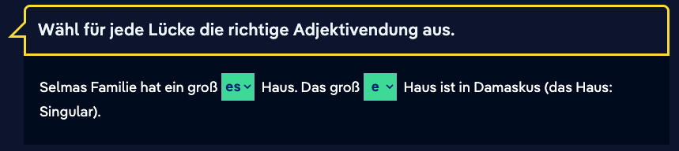

## Selma's life in Syria

Selma talks about her life in Syria. Write in the correct forms of the verbs "haben" or "sein".

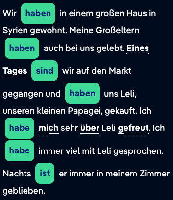

## Verbs and their participles

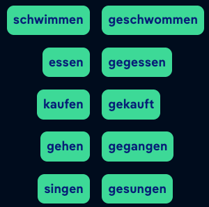

## Present to Present Perfect Tense

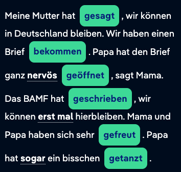

My mother said we could stay in Germany. We have received a letter. Dad opened the letter very nervously, says Mom. The BAMF wrote that we can stay here for the time being. Mom and Dad were very happy. Dad even danced a bit.

## Adjective declension

**Revision: adjective declension**

An adjective can directly precede the noun it describes. In this case, the adjective ending changes to match that of the noun. This change is known as adjective declension; there are three different declensions. The correct declension to use depends on the article before the noun: the indefinite article, the definite article or no article? 

**Revision: adjective declension after an indefinite article**

In the nominative and accusative cases, the adjective takes the ending of the **definite** article:

| Nominative         |                          |
| ------------------ | ------------------------ |
| *de**r*** Garten:  | ein große***r*** Garten  |
| *di**e*** Familie: | eine groß***e*** Familie |
| da***s*** Haus:    | ein große***s*** Haus    |
| di**e** Geschäfte: | groß***e*** Geschäfte    |

 In the accusative case, the masculine article – and along with it the adjective ending – changes. All other forms stay the same.

| Accusative           |                           |
| -------------------- | ------------------------- |
| de***n*** Garten:    | einen große***n*** Garten |
| di***e*** Familie:   | eine groß***e*** Familie  |
| da***s*** Haus:      | ein große***s*** Haus     |
| di***e*** Geschäfte: | groß***e\*** Geschäfte    |

**Exceptions:**

- Adjectives that end in *-el* or *-er*  often lose the *e* in front of the adjective ending:
  *teu***e***r: Wir hatten ein **teures** Auto.*
- A few adjectives (*super*, *extra* and some adjectives describing color) are not declined:
  *super: Das war ein **super** Essen.*

**Revision: Adjective declension after a definite article**

*Inge schenkt Nico* **ein** *gestreift***es** *Hemd. – Nico findet* **das** *gestreift***e** *Hemd nicht so schön.*

If an **indefinite article** is before the noun and adjective, the adjective (in the nominative and accusative cases) takes on the ending of the definite article.

But when a **definite** article is before the noun and adjective, the adjective only takes on the ending *-e* or *-en*.

| Nominative     |                                    |
| -------------- | ---------------------------------- |
| der Garten:    | de***r\*** groß***e\*** Garten     |
| die Familie:   | di***e\*** groß***e\*** Familie    |
| das Haus:      | da***s\*** groß***e\*** Haus       |
| die Geschäfte: | di***e\*** groß***en\*** Geschäfte |

| Accusative     |                                    |
| -------------- | ---------------------------------- |
| den Garten:    | de***n\*** groß***en\*** Garten    |
| die Familie:   | di***e\*** groß***e\*** Familie    |
| das Haus:      | da***s\*** groß***e\*** Haus       |
| die Geschäfte: | di***e\*** groß***en\*** Geschäfte |

In the accusative case, adjectives in front of masculine nouns take on the ending *-en*.

Adjectives in front of a plural noun also take on the ending *-en*.

**Revision: adjective declension after a possessive determiner or negative article**

For adjectives that come before a noun with a possessive determiner (e.g., *mein*, *dein*, *sein* …) or a negative article (*kein*), the declensions are as follows:

- in the **singular,** the adjective declension follows that of the **indefinite** article.
- In the **plural,** the adjective declension follows that of the **definite** article.

Masculine:
*kein* groß**er** Garten (nominative)
*keinen* groß**en** Garten (accusative)

Feminine:
*keine* groß**e** Familie (nominative and accusative)

Neuter:
kein groß**e\*s\*** Haus (nominative and accusative)

Plural:
*keine* groß**en** Geschäfte (nominative and accusative)

# Day 27

## Nicosweg A1 - Chapter 17 Health - part 4

Sätze:

- Sie sprechen über Nicos Bein.
  They talk about Nico's leg.
- Nico darf das Bein nicht bewegen.
  Nico is not allowed to move his leg.
- Nico soll die Tabletten nach dem Essen nehmen.
  Nico is supposed to take the tablets after eating.
- Nico darf in einem Monat wieder Sport machen.
  Nico will be allowed to do sports again in a month.
- Nico braucht keine Krankschreibung.
  Nico doesn't need a sick note.
- Was fehlt Ihnen denn?
  What are you missing?
- Wann muss ich die Medikamente nehmen?
  When do I have to take the medication?

Vokabeln:

- Salbe = ointment (salep in bahasa Indonesia)
- Krankschreibung = sick note
- Arbeitgeber = employer

## Online advice

Dr Grube and his peers provide health tips online. What are their recommendations? Read through the symptoms, then use the vocabulary words to write appropriate sentences in the imperative.

## Nico González may not …

Dr Grube writes a report about Nico. Try to write his instructions in new sentences using "sollen", "müssen" or "nicht dürfen". 

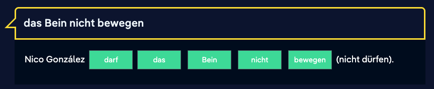

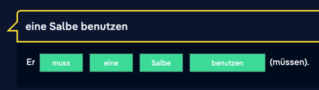

## Nominalization

Verbs usually describe an activity, a condition or an event. we can also nominalize verbs, which means converting a verb into a stand-alone noun by putting an article before the infinitive form of the verb. Nominalized infinitives always take a neuter article, and like other nouns are written with a capital letter and declined. 

Example:

**grillen -> das Grillen**

*Yanis findet das Grillen wichtiger als das Training.*

**essen -> das Essen**

*Nico soll die Tabletten nach dem Essen nehmen.*

**schlafen gehen -> das Schlafengehen**

*Nico soll die Salbe vor dem Schlafengehen benutzen.*

## Modal verbs: meaning

**Summary: the meaning of the modal verbs**

Modal verbs generally refer to a second verb – the main verb in the sentence. They describe a relationship between the subject and the activity expressed with the main verb. 

 

The following meanings are expressed using modal verbs:

 *können*: ability/possibility

*Nico kann Deutsch sprechen.*

(He has learned the language and therefore has the ability to speak it.)

*Nico kann bei Inge wohnen.*

(It is possible for him to live with Inge.)

 

*dürfen*: permission

*Emma darf eine Freundin besuchen.*

(Her mother allowed her to do it.)

*dürfen* + negation: forbidden

*Emma darf keinen Alkohol trinken.*

(Her parents did not let her drink alcohol and it is illegal to drink alcohol if you are underage.)

 

*müssen*: responsibility/necessity

*Emma muss die Hausaufgaben machen.*

(Her teacher will punish her for not having done her homework.)

*müssen* + negation: not necessary

*Wir müssen nicht mehr trainieren.*

(We are fit enough and do not need to work out anymore.)

 

*sollen*: commands/requests

*Nico soll studieren.*

(His parents want him to study.)

 

*wollen*: (strong) wish or consideration

*Lisa will heute Abend mit Nina ins Kino gehen.*

(Lisa plans to go to the cinema with Nina.)

 

*möchten*: (politely formulated) desire

*Selma möchte als Architektin arbeiten.*

(She wants to work as an architect.)

## Modal verbs: conjugation

**Summary: conjugation of modal verbs**

For most modal verbs the following is true:

- In the singular, the vowel changes.
- The first- and third-person singular forms of the verb are the same.

Take another look at how the various modal verbs are conjugated: 

**können**

| *Singular* |                          |
| ---------- | ------------------------ |
| 1st person | ich *k**a**nn*           |
| 2nd person | du *k**a**nnst*          |
| 3rd person | er/sie/es/man *k**a**nn* |
| *Plural*   |                          |
| 1st person | wir können               |
| 2nd person | ihr könnt                |
| 3rd person | sie können               |
| *Formal*   | Sie können               |

**dürfen**

| *Singular* |                          |
| ---------- | ------------------------ |
| 1st person | ich *d**a**rf*           |
| 2nd person | du *d**a**rfst*          |
| 3rd person | er/sie/es/man *d**a**rf* |
| *Plural*   |                          |
| 1st person | wir dürfen               |
| 2nd person | ihr dürft                |
| 3rd person | sie dürfen               |
| *Formal*   | Sie dürfen               |

**müssen**

| *Singular* |                          |
| ---------- | ------------------------ |
| 1st person | ich *m**u**ss*           |
| 2nd person | du *m**u**sst*           |
| 3rd person | er/sie/es/man *m**u**ss* |
| *Plural*   |                          |
| 1st person | wir müssen               |
| 2nd person | ihr müsst                |
| 3rd person | sie müssen               |
| *formal*   | Sie müssen               |

 

**sollen**

| *Singular* |                      |
| ---------- | -------------------- |
| 1st person | ich *soll*           |
| 2nd person | du sollst            |
| 3rd person | er/sie/es/man *soll* |
| *Plural*   |                      |
| 1st person | wir sollen           |
| 2nd person | ihr sollt            |
| 3rd person | sie sollen           |
| *Formal*   | Sie sollen           |

**wollen**

| *Singular* |                    |
| ---------- | ------------------ |
| 1st person | ich *w**i**ll*     |
| 2nd person | du *w**i**llst*    |
| 3rd person | er/sie/es w**i**ll |
| *Plural*   |                    |
| 1st person | wir wollen         |
| 2nd person | ihr wollt          |
| 3rd person | sie wollen         |
| *Formal*   | Sie wollen         |

**möchten**

| *Singular* |                      |
| ---------- | -------------------- |
| 1st person | ich möchte           |
| 2nd person | du möchtest          |
| 3rd person | er/sie/es/man möchte |
| *Plural*   |                      |
| 1st person | wir möchten          |
| 2nd person | ihr möchtet          |
| 3rd person | sie möchten          |
| *Formal*   | Sie möchten          |

# Day 26

## Nicosweg A1 - Chapter 17 Health - part 3

Sätze:

- Lisa findet Nico in einem anderen Behandlungsraum. 
  Lisa finds Nico in another treatment room.
- Du musst mit dem Aufzug in den dritten Stock fahren. 
  You have to take with lift to third floor.
- Geh dann den Flur entlang. 
  Then go down to corridor.
- Das Zimmer ist auf der rechten Seite. 
  The room is on the right side
- Der Freund hat den Krankenwagen gerufen. 
  The friend called the ambulance
- Tarek hatte eine Verletzung am Kopf. 
  Tarek has an accident in the head

Vokabeln:

- Behandlungsraum = treatment room
- Aufzug = lift
- Unfall = accident
- Gute Besserung! = get well soon

## **What happened?**

Repeat the present perfect forms you know that you hear in Tarek and Max's stories. Select the fitting words for each infinitive.

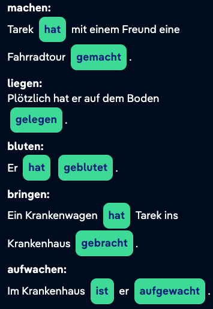

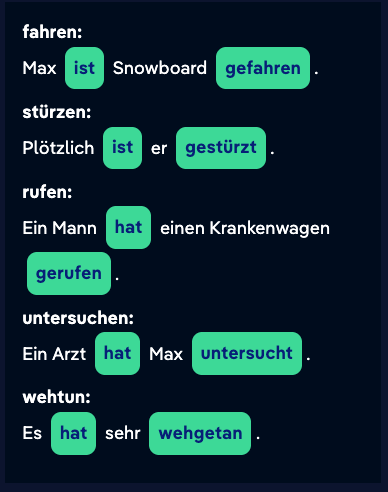

## Lisa's text message about Nico's accident

Lisa is writing a text message about Nico's accident. Use the correct past participle of the verb. Careful: the infinitives are not listed in the order they are to be used in the text.

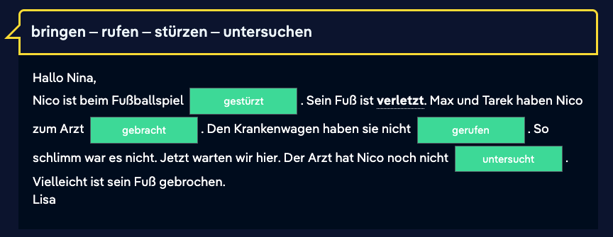

## Present perfect

**Revision: present perfect**

*Ich **habe** gestern Fußball **gespielt**.*

In spoken language, we often use the present perfect tense to talk about something that happened in the past.

The present perfect is formed from two parts:

a) In second position in the sentence is a simple clause with the auxiliary verb *haben* or *sein*. It is conjugated as in the present tense.

b) The activity described in the sentence is expressed using the second verb at the end of the sentence. This verb is in a special form, the past participle. Most past participles start with the prefix *ge-**.* The past participle in the present perfect tense is an infinitive form, meaning it is not conjugated.

Grammatical terms in German:das Perfekt: The present perfect is a verb tense that expresses an event in the past. It is formed using the conjugated form of the auxiliary verb (*haben* or *sein*) and the past participle.

## Present perfect: auxiliary verbs

**Revision: present perfect with** ***haben\*** **or** ***sein\*****?**

Most verbs make the perfect with the auxiliary verb *haben*. Verbs that could take an accusative object always form the perfect tense with *haben*:

*Max und Tarek haben **mich** zum Arzt gebracht.*

Verbs that make the present perfect with *sein* are …

... verbs that express movement in a particular direction or signify a change of location, e.g. *gehen*, *fahren*, *fliegen*, *schwimmen* and *reisen**:
Wir sind sofort zum Arzt gefahren.*

... verbs that describe a change of condition or state that cannot be controlled, e.g. *einschlafen**,* *aufwachen* and *passieren*.
*Ich bin im Krankenhaus aufgewacht.*

... the verbs *sein, bleiben* and *werden*.
*Ich bin drei Tage im Krankenhaus geblieben.*

## The past participle

**Revision: the past participle**

The past participle of regular verbs ends in *-(e)t*.

The past participle of irregular verbs usually ends in *-en*.

For most verbs, the past participle begins with *ge-**.* Some verbs which make the past participle without *ge-* are:

- Verbs that end in *-ieren*
- Verbs with inseparable prefixes, i.e., *be-*, *ent-*, *er-*, *ver-*, *zer-*

In separable verbs, the -*ge-* comes between the prefix and the verb stem. 

Examples: regular verbs

| Infinitive | Past participle               |
| ---------- | ----------------------------- |
| stürzen    | ***ge\*-**stürz**-\*t\***     |
| passieren  | passier**-\*t\***             |
| aufwachen  | auf**-\*ge\*-**wach**-\*t\*** |

Examples: irregular verbs

| Infinitive    | Past participle                  |
| ------------- | -------------------------------- |
| l**ie**gen    | ***ge-\***l**e**g***-en\***      |
| verst**e**hen | verst**a**nd***-en\***           |
| mitn**eh**men | mit-***ge\***-n**om**m-***en\*** |

# Day 25

## Nicosweg A1 - Chapter 17 Health - part 2

Sätze:

- Nico hat Schmerzen und kann nicht gut laufen.
  Nico is in pain and can't walk well.
- Max und Tarek haben schon in der Arztpraxis angerufen.
  Max and Tarek have already called the doctor's office.
- Sein Fuß ist **dick** und tut sehr weh
  His foot is **thick** and hurts a lot

Vokabeln:

- Gebrochen = broken
- [Krankenversicherung](https://learngerman.dw.com/en/health-insurance/l-37778169/e-37781604#) = health insurance
- bis gleich = see you in a little while 

## Conjugation of "dürfen"

Emma's mother gets an email from her daughter. Read through the text and then match the personal pronouns to the correctly conjugated form of the modal verb "dürfen".

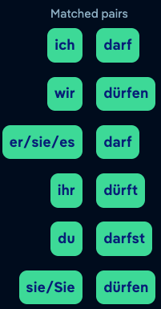

## Prohibitions and commands

To express prohibition, we use the modal verb "dürfen + nicht/kein". For other forms of obligation (without a negative) we use the modal verb "müssen".
Sebastian darf **keinen** Alkohol trinken.
Sebastian muss Medikamente nehmen.

Although the verb "müssen" expresses obligation, "müssen + nicht/kein" does not mean something is prohibited. It means it's not necessary.
Sebastian ist krank. Er **darf nicht** arbeiten.
Sebastian hat Urlaub. Er **muss nicht** arbeiten.

Example:
„Du darfst nicht Gitarre spielen. Die Nachbarn schlafen.“
"You're not allowed to play the guitar. The neighbors are asleep."

## Allowed and not allowed

Look at the pictograms, then form sentences using "dürfen", "nicht dürfen" and "müssen". The subject is "man".

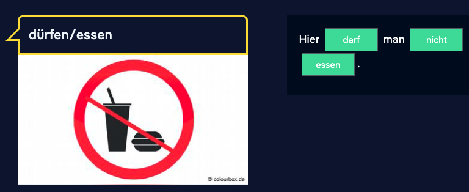

## Modal verbs: dürfen

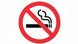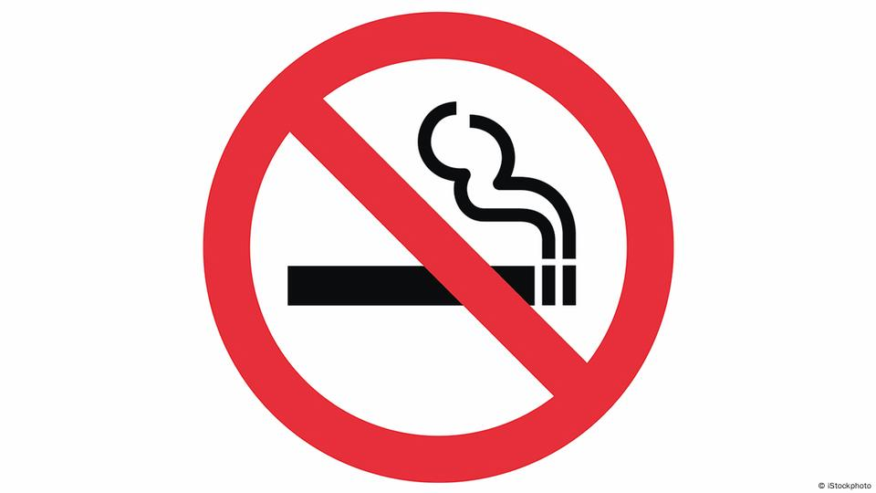

*Hier **darf** man nicht **rauchen**.*

In this lesson you will learn the last of the modal verbs, *dürfen*. You already know the others. We use *dürfen* to express that a person has permission or the right to do something. This permission is usually given by someone in a position of authority, like a parent, doctor, or official.

*Sie **dürfen** Wasser oder Tee **trinken**.*

*Hier **dürfen** Sie zwei Stunden **parken**.*

Similarly, the authorities can deny someone permission to do something, in which case *dürfen* would be used with negation.

*Sie **dürfen*** keinen *Kaffee **trinken**.*

*Hier **dürfen** Sie* nicht ***parken**.*

 

Conjugation:

As with most of the other modal verbs, the vowel changes in the singular form; the verb form is the same in the first- and third-person singular.

| *Singular:* |                          |
| ----------- | ------------------------ |
| 1st person  | ich *d**a**rf*           |
| 2nd person  | du *d**a**rfst*          |
| 3rd person  | er/sie/es/man *d**a**rf* |
| *Plural:*   |                          |
| 1st person  | wir dürfen               |
| 2nd person  | ihr dürft                |
| 3rd person  | sie dürfen               |
| *Formal:*   | Sie dürfen               |

 

**Revision: \*müssen\***

As a comparison, take another look at sentences that use the modal verb *müssen:*

The verb *müssen* expresses a necessity or requirement; a person is forced to do something:

*Er **muss** arbeiten.* (He has to work because he needs money in order to live.)

When the verb *müssen* is negated, it means there is neither pressure to do something, nor is it expressly forbidden. It means that it is not necessary for a person to do something, but they can do it if they like.

*Er **muss nicht** arbeiten.* (He is rich and has enough money to live on, but perhaps he chooses to work because he enjoys it.)

# Day 24

## Nicosweg A1 - Chapter 17 Health - part 1

**Sätze:**

- Nico hat einen Sportunfall.Ein Fußballspieler hilft Nico zur Bank.Tarek kühlt Nicos Fuß.
  Nico has a sports accident.A soccer player helps Nico to the bench.Tarek cools Nico's foot.
- Alles okay, Nico? Geht es dir gut?Ich habe Schmerzen.Wir sehen uns das mal an.Wo tut es denn genau weh? Ist es das Knie oder das Bein?Der Fuß.
  Everything okay, Nico? Are you okay? I'm in pain.We'll take a look. Where exactly does it hurt? Is it the knee or the leg? The foot.
- Ich habe Schmerzen am Fuß.
  I have pain in my foot.
- Mein Fuß tut weh.
  My foot hurts.
- Tun deine Augen auch weh?
  Do your eyes hurt too?
- Ja, das geht.
  Yes, that's possible
- Was haben viele Leute bei Regen, Schnee und Kälte?
  What do many people have in rain, snow and cold?
- Man soll abwechselnd heiß und kalt duschen.
  You should alternate between hot and cold showers.

**Vokabeln:**

- gestürzt = plunged / fallen
- Schmerzen = pain
  - Kopfschmerzen = headache
  - Bauchschmerzen = stomachache
  - Ohrenschmerzen = earache
  - Rückenschmerzen = backache or backpain
  - Zahnschmerzen = toothache
  - Hals-schmerzen = sore throat
- blutet = bleed
- Zeig mal = Let me see
- Schon wieder = (once) again
- tut so weh = hurt so much
- schlimme = bad, terrible, awful, severe
- Rücken = back
- Schultern = shoulder
- Arme = arm
- Schmerztablette = painkiller
- Husten = cough
- Schnupfen = a cold (runny nose)
- Fieber = fever
- Erkältung = Cold or Flu
- Verletzung = pain or injury

## Are you ok?

How do you ask someone if they've hurt or injured themselves? In the audio you will hear three dialogues. Listen to the dialogues and choose the questions that Max asks Yanis.

- Geht es dir (nicht) gut?
- Alles okay?
- Was ist denn passiert?
- Was ist denn los?

## Tips from the pharmacy (2)

Nico got an email from Emma. She has a cold. That reminds Nico of all the tips he read in the pharmacy's magazine. Read the tips once again, then write the tips in the imperative form. 

<h4 style="font-family: Pangea, sans-serif; font-variation-settings: &quot;opsz&quot; 10; box-sizing: border-box; margin: 0px;">Script<svg width="30" height="30" viewBox="0 0 30 30" xmlns="http://www.w3.org/2000/svg" stroke="currentcolor" class="s1mkl8uq" data-testid="toggleable-arrow" aria-hidden="true"><path d="m27 10.5-12 9-12-9" stroke-width="1.5" fill="none" fill-rule="evenodd"></path></svg></h4>

<strong style="font-family: Pangea, sans-serif; font-variation-settings: &quot;opsz&quot; 10; box-sizing: border-box; font-weight: 600;"></strong> 

<strong style="font-family: Pangea, sans-serif; font-variation-settings: &quot;opsz&quot; 10; box-sizing: border-box; font-weight: 600;"></strong> 

<strong style="font-family: Pangea, sans-serif; font-variation-settings: &quot;opsz&quot; 10; box-sizing: border-box; font-weight: 600;"></strong> <a class="glossary" href="https://learngerman.dw.com/en/tips-from-the-pharmacy-2/l-37778457/e-37787543#" style="font-family: Pangea, sans-serif; font-variation-settings: &quot;opsz&quot; 10; box-sizing: border-box; font-size: 1rem; color: rgb(255, 255, 255); line-height: 1.4; font-weight: 600; text-decoration: none; outline: rgb(0, 33, 134) 0px; cursor: help; border-bottom: 1px dotted rgb(255, 255, 255); border-top-color: rgb(255, 255, 255); border-right-color: rgb(255, 255, 255); border-left-color: rgb(255, 255, 255);"></a><a class="glossary" href="https://learngerman.dw.com/en/tips-from-the-pharmacy-2/l-37778457/e-37787543#" style="font-family: Pangea, sans-serif; font-variation-settings: &quot;opsz&quot; 10; box-sizing: border-box; font-size: 1rem; color: rgb(255, 255, 255); line-height: 1.4; font-weight: 600; text-decoration: none; outline: rgb(0, 33, 134) 0px; cursor: help; border-bottom: 1px dotted rgb(255, 255, 255); border-top-color: rgb(255, 255, 255); border-right-color: rgb(255, 255, 255); border-left-color: rgb(255, 255, 255);"></a><a class="glossary" href="https://learngerman.dw.com/en/tips-from-the-pharmacy-2/l-37778457/e-37787543#" style="font-family: Pangea, sans-serif; font-variation-settings: &quot;opsz&quot; 10; box-sizing: border-box; font-size: 1rem; color: rgb(255, 255, 255); line-height: 1.4; font-weight: 600; text-decoration: none; outline: rgb(0, 33, 134) 0px; cursor: help; border-bottom: 1px dotted rgb(255, 255, 255); border-top-color: rgb(255, 255, 255); border-right-color: rgb(255, 255, 255); border-left-color: rgb(255, 255, 255);"></a>

<strong style="font-family: Pangea, sans-serif; font-variation-settings: &quot;opsz&quot; 10; box-sizing: border-box; font-weight: 600;"></strong> 

<strong style="font-family: Pangea, sans-serif; font-variation-settings: &quot;opsz&quot; 10; box-sizing: border-box; font-weight: 600;"></strong> 

<strong style="font-family: Pangea, sans-serif; font-variation-settings: &quot;opsz&quot; 10; box-sizing: border-box; font-weight: 600;"></strong> 

<strong style="font-family: Pangea, sans-serif; font-variation-settings: &quot;opsz&quot; 10; box-sizing: border-box; font-weight: 600;"></strong> 

<strong style="font-family: Pangea, sans-serif; font-variation-settings: &quot;opsz&quot; 10; box-sizing: border-box; font-weight: 600;"></strong> <a class="glossary" href="https://learngerman.dw.com/en/tips-from-the-pharmacy-2/l-37778457/e-37787543#" style="font-family: Pangea, sans-serif; font-variation-settings: &quot;opsz&quot; 10; box-sizing: border-box; font-size: 1rem; color: rgb(255, 255, 255); line-height: 1.4; font-weight: 600; text-decoration: none; outline: rgb(0, 33, 134) 0px; cursor: help; border-bottom: 1px dotted rgb(255, 255, 255); border-top-color: rgb(255, 255, 255); border-right-color: rgb(255, 255, 255); border-left-color: rgb(255, 255, 255);"></a>

<strong style="font-family: Pangea, sans-serif; font-variation-settings: &quot;opsz&quot; 10; box-sizing: border-box; font-weight: 600;"></strong>  

1. Gehen Sie oft nach draußen – auch im Winter. 
2. Duschen Sie abwechselnd heiß und kalt.
3. Sie müssen viel trinken, am besten Tee, Wasser und Orangensaft! 
4. Essen Sie viel Obst und Gemüse. 

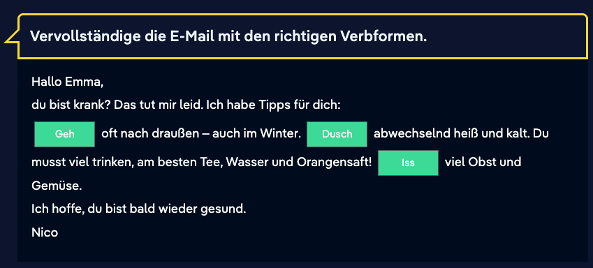

## Müssen or sollen?

**Summary: the modal verbs** ***müssen\*** **and** ***sollen\***

The modal verbs *müssen* and *sollen* are used in similar ways, but they are slightly different in meaning. 

The verb *müssen* expresses an objective necessity and sounds more urgent: If one does not do what is necessary, there will be serious consequences.

Example:

*1) Nico **muss** zum Arzt gehen.*

Nico has injured himself and needs medical help. If he does not go to the doctor, he may be in pain for some time or even suffer long-term health problems.

*2) Nico **muss** Deutsch lernen.*

Nico would like to stay in Germany for a long time. To be able to live in Germany, he needs to speak German. Without the language, life in Germany will be hard for him.

 

The verb *sollen* is generally used to report a request or an order given by someone else. What the person at whom the order is directed thinks of it is not relevant in the sentence.

Examples:

*1) Nico **soll** den Fuß kühlen.*

Another person (e.g. Tarek or a doctor) says that Nico should cool his foot with an ice pack.

*2) Nico **soll** studieren.*

Nico's parents want Nico to study at university. Whether Nico himself would like to do this or finds it important is not in question.

# Day 23

## Nicosweg A1 - Chapter 16 Sports and exercise - part 4

Sätze:

- Yanis isst Süßigkeiten.
  Yanis eats sweets.

- Yanis wollte Äpfel, Bananen und Birnen kaufen.
  Yanis wanted to buy apples, bananas and pears.

- Das Wichtigste ist die Ernährung.
  Iss viel Obst!
  Trink keinen Alkohol und rauch nicht!
  Trink viel Wasser und iss keine Süßigkeiten!

  The most important thing is nutrition.
  Eat lots of fruit!
  Don't drink alcohol or smoke!
  Drink plenty of water and don't eat sweets!

- Bei einer Diät isst man wenig Fett und Zucker.
  On a diet, you eat little fat and sugar.

- Du möchtest abnehmen? Dann musst du dich gesund ernähren. Iss viel Obst wie Ananas, Äpfel und [Kirschen](https://learngerman.dw.com/en/tips-for-losing-weight/l-37670365/e-37706356#) und Gemüse wie Karotten, Tomaten und Brokkoli. Trink viel Wasser, aber keine süßen Getränke. [Vorsicht](https://learngerman.dw.com/en/tips-for-losing-weight/l-37670365/e-37706356#) mit Fett! Iss kein [fettes](https://learngerman.dw.com/en/tips-for-losing-weight/l-37670365/e-37706356#) Fleisch oder [Mayonnaise](https://learngerman.dw.com/en/tips-for-losing-weight/l-37670365/e-37706356#) und nur wenig Butter.

  Aber nicht nur die Ernährung ist wichtig, du musst dich auch bewegen. Geh regelmäßig joggen oder ins Fitnessstudio. Abnehmen kann auch Spaß machen. Triff dich mit deinen Freunden zum Fußballspielen oder zum Schwimmen.

  You want to lose weight? Then you have to eat healthy. Eat plenty of fruits like pineapples, apples, and cherries, and vegetables like carrots, tomatoes, and broccoli. Drink plenty of water, but no sweet drinks. Be careful with grease! Don't eat fatty meat or mayonnaise and only a little butter.

  But not only the diet is important, you also have to move. Go jogging or going to the gym regularly. Losing weight can also be fun. Meet up with your friends to play soccer or swim.

Vokabeln:

- raucht = smoke
- Ernährung = nutrition
- Kekse = cookies

## Informal imperatives (1)

We often use the imperative to give tips or make suggestions. An imperative verb comes at the beginning of the sentence.
Singular: **Rauch** nicht!
Plural: **Raucht** nicht!
As you can see, we don't use "du" and "ihr" in the imperative.

In the singular, the imperative is usually formed with the verb stem of the second-person singular. The ending "-st" is dropped.
du rauchst → Rauch!
du nimmst → Nimm!

In the plural, the imperative takes the same form as the second-person plural.
ihr raucht → Raucht!
ihr nehmt → Nehmt!

## Informal imperatives (2)

Do you recall the formal health tips from the last lesson? Now give tips to a person or group of people who you address with the informal "du" and "ihr". Arrange the sentences in the right order. 

- Geh regelmäßig spazieren.
  Walking regularly.
- Macht jede Woche Krafttraining.
  Does strength training every week.

## Imperative: informal

**The informal imperative in the singular**

**a) Forms without an ending**

In the informal imperative, a distinction is made between the singular and the plural forms of a word. In the singular form, the verb in the second person forms the basis, with the *-st* ending removed. Verbs with a root that ends in -*s*, -*ß*, -*z* or *-x* only leave out the -*t*. In the singular, the informal imperative usually takes no ending.

*(Du) mach(st) viel Sport. ->* **I\**mperati\**v:** ***Mach** viel Sport!*

*(Du) geh(st) oft spazieren. ->* **Imperativ:** ***Geh** oft spazieren!*

*(Du) putz(t) regelmäßig die Zähne. ->* **Imperativ:** ***Putz** regelmäßig die Zähne!*

*(Du) iss(t) mehr Obst. ->* **Imperativ: \*Iss\*** *mehr Obst!*

Verbs with a vowel change from *a* to *ä have* no umlaut in the imperative.

*(Du) f**ä**hr(st) mit dem Fahrrad zur Arbeit. ->* **I\**m\**perativ: \*Fahr\*** *mit dem Fahrrad zur Arbeit!*

*(Du) schl**ä**f(st) genug. ->* **I\**m\**perativ: \*Schlaf\*** *genug!*

**b) Special forms ending in** ***-e\***

Many imperative forms can be formed with the ending *-e. O*ften it is a matter of style whether we say:

*Mach jeden Tag Sport!*
or: 
*Mach**e** jeden Tag Sport!*

The first variant is more common in spoken language, whereas we usually find the second in written language. Some imperative forms sound old-fahioned or didactic when used with the ending *-e*.

When a verb ends in *-est* in the second person singular, in the imperative the *-e* remains.

 *(Du) arbeit**e**(st) nicht zu viel. ->* **Imperativ:** *Arbeit**e** nicht zu viel!*

*(Du) öffn**e**(st) das Fenster. ->* **Imperativ:** *Öffn**e** das Fenster!*

When the vowel changes from *e* to *i* (i.e., *essen* -> *Iss!*) the ending *-e* cannot be used.

 

**The informal imperative in the plural**

When we use the imperative with more than one person, we use the plural form. This can be created using the second-person plural in the present tense. The personal pronoun is not used but the ending remains unchanged.

*(Ihr) macht viel Sport. ->* **Imperativ: \*Macht\*** *viel Sport!*

*(Ihr) esst mehr Obst. ->* **Imperativ: \*Esst\*** *mehr Obst!*

*(Ihr) fahrt mit dem Fahrrad zur Arbeit. ->* **Imperativ: \*Fahrt\*** *mit dem Fahrrad zur Arbeit!*

*(Ihr) arbeitet nicht zu viel. ->* **Imperativ: \*Arbeitet\*** *nicht zu viel.*

**Overview: imperative**

The regular forms of the imperative are as follows:

| Informal (singular) | ***Trink(e)\*** *viel Wasser!*    |
| ------------------- | --------------------------------- |
| Informal (plural)   | ***Trinkt\*** *viel Wasser!*      |
| Formal              | ***Trinken Sie\*** *viel Wasser!* |

The forms of the verb *sein* are irregular:

| Informal (singular) | ***Sei\*** *fair!*       |
| ------------------- | ------------------------ |
| Informal (plural)   | ***Seid\*** *fair!*      |
| Formal              | ***Seien\*** *Sie fair!* |

Grammatical terms in German:der Imperativ: The imperative is a verb form used to make a request, or give a command or instructions.

# Day 22

## Nicosweg A1 - Chapter 16 Sports and exercise - part 3

Sätze:

- Max möchte weitertrainieren.
  Max wants to continue training.

- Tarek möchte sich **ausruhen**.
  Tarek wants to **rest**.

- **Max:** Wir müssen besser und schneller spielen, [besonders](https://learngerman.dw.com/en/higher-faster-farther-1/l-37668815/e-37669999#) die Technik ist bei uns allen schlechter geworden. Außerdem …
  **Tarek:** … höher [springen](https://learngerman.dw.com/en/higher-faster-farther-1/l-37668815/e-37669999#) und mehr Tore schießen …

  Max: We have to play better and faster, especially the technique has gotten worse for all of us. In addition...
  Tarek: ... jump higher and score more goals...

- Normalerweise ist Anton am schnellsten.
  Usually, Anton is the fastest.

- Markus ist am weitesten gesprungen.
  Markus jumped the furthest.

- Rauch nicht
  Not smoke

- [Tun](https://learngerman.dw.com/en/stay-fit-1/l-37668815/e-37671701#) Sie etwas für Ihre [Gesundheit](https://learngerman.dw.com/en/stay-fit-1/l-37668815/e-37671701#)!
  **Do** something for your **health**

- Tipps zur **Ernährung**

  **Nutrition** tips

- Viel bewegen!
  Move a lot!

Vokabeln:

- schneller = speedy
  - am schnellsten = fastest
- schlechter = worse
  - am schlechtesten = worst
- höher = higher
  - am höchsten = highest
- mehr = more
- am weitesten = farthest
- länger = long
  - am längsten = longest
- größer = bigger
  - am größten = biggest
- Alltag = everyday life
- ausruhen = rest
- regelmäßig = regularly

## Compare

Lisa spricht gut Englisch. Nina spricht Englisch als Lisa. Aber Max spricht Englisch.

## Fitness tips (1)

Do you remember what you learned about giving directions and instructions? Now formulate your recommendations for staying fit and healthy by using "Sie" and the formal imperative.

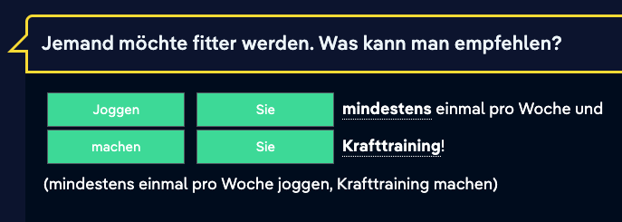

**Ruhen Sie sich** **aus** und schlafen Sie genug!
Rest and sleep a lot

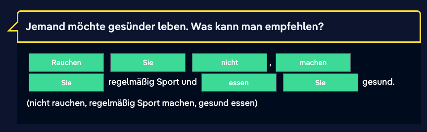

## Comparison (4)

**Irregular comparatives:** ***nah/nahe\******\**** **and** ***hoch\***

The adjectives *nah(e)* and *hoch* have irregular forms:

*nah(e) < näher < am nä***c***hsten*

*ho***c***h < höher < am hö***c***hsten*

 

*Yanis springt **hoch**.*

*Tarek springt **höher**.*

*Max springt **am höchsten**.*

***** The adjectives *nah* and *nahe* have the same meaning. They are variants of the same word.
