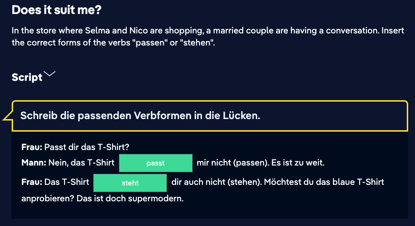
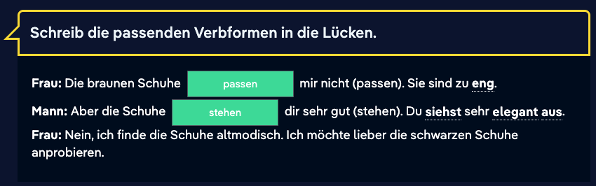
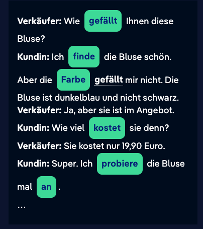

# 09 Oct

## Nicosweg A1 - Chapter 14 Clothing - part 3

**Sätze:**

- Nico probiert Hemden an.
  Nico tries on shirts.
- Selma sucht Hemden und Jacken.
  Selma is looking for shirts and jackets.
- Das steht dir gut!
  That looks good on you!
- Ja, das [passt](https://learngerman.dw.com/en/the-shirt-doesnt-fit-me/l-37661740/e-37662072#) auch.
  Yes, it is also fit

**Vokabeln:**

- Große = size or big
- modern / altmodisch = modern / old-fashioned
- weit / eng = wide / tight
- dick / dünn = thick / thin
- egal = does not matter

## **Akkusativ und Dativ**

Many German verbs require an accusative object. Several verbs, however, take a dative object. The verbs "passen" and "stehen" belong to this group of verbs. The dative object indicates towards whom an action is directed and therefore it is often a person. Personal pronouns such as "ich" or "du" can also be used as dative objects. Then they will be put in the dative.
ich – mir (Dativ)
du – dir (Dativ)

**Beispiele:** 
Die Hose steht mir nicht. 
Das T-Shirt passt dir nicht.

Plural example:

## I will try on the blouse

## Verbs with a dative object (1)

*Das Hemd passt **dir** nicht.* *Es ist zu groß.*

Many German verbs need an object. The object is often in the accusative case. However, some German verbs are used with a dative object. The dative object is often at the receiving end of an action, and is therefore commonly a person. The verbs *passen* and *stehen* are examples of verbs used with a dative object.

Examples:

*Das Hemd passt **dem Mann** nicht.
Die Hose steht **der Frau** nicht.
Der Pullover passt **dem Kind** nicht.
Die dunklen Jacken stehen **den Kindern** nicht.*

## zu + adjective (2)

When we use *zu* + adjective, we are expressing the view that the quantity, size or intensity of something is not good, or not quite right. It means that the person using the expression finds something inappropriate or unacceptable.

*Das Hemd ist **zu** teuer.*

This can mean:

1. The price of the shirt is unreasonably high.
2. The price is reasonable but I do not have enough money to pay for it, or I am not prepared to pay that much for it.

In the second instance, the subjective meaning being emphasized is: for me, personally, the shirt is too expensive. To express this even more clearly, the personal pronoun in the dative case can be used:

*Das Hemd ist **mir** zu teuer.*

 

When we are talking about clothing, the following construction is often used:

*Das Kleid ist **mir** zu groß.
Die Schuhe sind **mir** zu klein.
Die Hose ist **mir** zu lang.
Der Rock ist **mir** zu kurz.*

# 08 Oct

## Nicosweg A1 - Chapter 14 Clothing - part 2

https://learngerman.dw.com/en/nicos-bag-1/l-37656274/e-37656418

**Sätze:**

- Sie sprechen über Lieblingsfarben.
  They talk about favorite colors.
- Sie sprechen über die Kleidung in Nicos Tasche.
  They talk about the clothes in Nico's bag.
- Selma findet ein T-Shirt und eine Mütze.
  Selma finds a T-shirt and a hat.

**Vokabeln:**

- Aussagen = testify, give evidence
- Hemd = shirt
- Mütze = hat
- grau = gray
- schwary = black
- mische = mix
- die Lieblingsfarbe = favorite color
- bunt = colorful

## Question words: welch-

**Revision: the question word** ***welch-\***

The question word *welch-* is used to ask about a particular person or thing, or to select one thing from a larger quantity.

***Welches*** *Kleid findest du schöner?*

The question word *welch-* comes before the noun and has the same ending as the definite article.

|                   | Nominative  | Accusative  |
| ----------------- | ----------- | ----------- |
| Masculine *(der)* | **welcher** | **welchen** |
| Feminine *(die)*  | welche      | welche      |
| Neuter  *(das)*   | welches     | welches     |
| Plural *(die)*    | welche      | welche      |

## Demonstrative: dies-

A demonstrative is used to signify a particular thing or to select an item from a larger group. Sometimes we might point at the object intended.

***Dieses*** *Kleid finde ich schön.*

Like the question word *welch-,* the demonstrative *dies-* takes the same ending as the definite article.

|                   | Nominative | Accusative |
| ----------------- | ---------- | ---------- |
| Masculine *(der)* | **dieser** | **diesen** |
| Feminine *(die)*  | diese      | diese      |
| Neuter  *(das)*   | dieses     | dieses     |
| Plural *(die)*    | diese      | diese      |

- ***Welcher*** Pullover ist am teuersten? – ***Dieser*** Pullover ist am teuersten.
- ***Welchen*** Pullover findest du am schönsten? – ***Diesen*** Pullover finde ich am schönsten.*
- ***Welche*** Hose ist am billigsten? – ***Diese*** Hose ist am billigsten.*
- ***Welches*** Kleid möchten Sie? – Ich möchte ***dieses*** Kleid, bitte.*
- ***Welche*** Turnschuhe nehmen Sie? – Ich nehme ***diese*** Turnschuhe hier.
